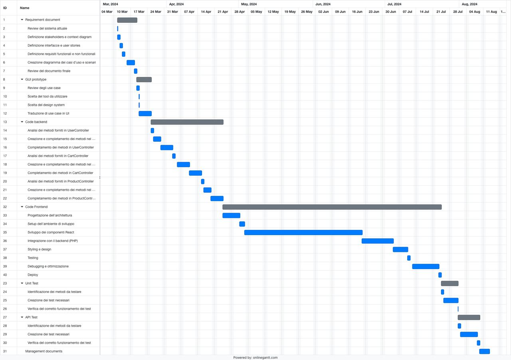

# Project Estimation - FUTURE
Date:

Version: V2

# Estimation approach
Consider the EZElectronics  project in FUTURE version (as proposed by your team in requirements V2), assume that you are going to develop the project INDEPENDENT of the deadlines of the course, and from scratch (not from V1)
# Estimate by size
### 
|             | Estimate                        |             
| ----------- | ------------------------------- |  
| NC =  Estimated number of classes to be developed   |             9                |             
|  A = Estimated average size per class, in LOC       |           200              | 
| S = Estimated size of project, in LOC (= NC * A) |              1800 |
| E = Estimated effort, in person hours (here use productivity 10 LOC per person hour)  |                  180                    |   
| C = Estimated cost, in euro (here use 1 person hour cost = 30 euro) | 5400 | 
| Estimated calendar time, in calendar weeks (Assume team of 4 people, 8 hours per day, 5 days per week ) |      1              |                  

#### Spiegazione delle stime di Estimated by size

Le classi che devono essere sviluppate sono solo quelle del negozio, dell'indirizzo e modello. La media di 200 LOC per classe è basata sul fatto che di solito un metodo ha 10/20 righe.

Basandoci poi sulla GUI sviluppata, una stima ottimale delle righe necessarie per svilupparla sono 5700(570phr), che portano il costo del lavoro a 22500 euro.

Considerando invece la documentazione sviluppata nel progetto invece si hanno 1870 righe di markdown, che equivalgono a 187hr e che portano il costo del progetto a 28110 euro.

# Estimate by product decomposition
### 
|         component name    | Estimated effort (person hours)   |             
| ----------- | ------------------------------- | 
| requirement document   | 60 |
| GUI prototype |30|
| design document |0|
| code |750|
| unit tests | 40 |
| api tests | 60 |
| management documents  | 13|

# Estimate by activity decomposition
### 
|         Activity name    | Estimated effort (person hours)   |             
| ---------------------------- | -------------------------------: | 
|**Requirement document**    | **52** |
| --Review del sistema attuale| 5 |
| --Definizione stakeholders e context diagram| 10 |
| --Definizione interfacce e user stories| 4 |
| --Definizione requisiti funzionali e non funzionali| 13 |
| --Creazione diagramma dei casi d’uso e scenari| 12 |
| --Review del documento finale| 8 |
| **GUI prototype** |**30**|
| Review degli use case | 5 |
| Scelta del tool da utilizzare | 1 |
| Scelta del design system | 1 |
| Traduzione di use case in UI | 23 |
| **Code backend** |**180**|
| --Analisi dei metodi forniti in UserController| 10|
| --Creazione e completamento dei metodi nel UserDAO| 25|
| --Completamento dei metodi in UserController| 25|
| --Analisi dei metodi forniti in CartController| 10 |
| --Creazione e completamento dei metodi nel CartDAO| 25|
| --Completamento dei metodi in CartController| 25|
| --Analisi dei metodi forniti in ProductController| 10|
| --Creazione e completamento dei metodi nel ProductDAO| 25|
| --Completamento dei metodi in ProductController| 25 |
| **Code frontend**|**540**|
| --Progettazione dell'architettura| 40|
| --Setup dell'ambiente di sviluppo| 15|
| --Sviluppo dei componenti React| 280 |
| --Integrazione con il backend (PHP)| 70 |
| --Styling e design| 30 |
| --Testing| 15 |
| --Debugging e ottimizzazione: Variabile, ma considerando un 15% del tempo totale | 60 |
| --Deploy| 10 |
| **Unit tests** | **40** |
| --Identificazione dei metodi da testare|5|
| --Creazione dei test necessari|30|
| --Verifica del corretto funzionamento dei test|5|
| **api tests** | **55** |
| --Identificazione dei metodi da testare|5|
| --Creazione dei test necessari|40|
| --Verifica del corretto funzionamento dei test|10|
| **Management documents**  | **13** |
###

# Summary

Report here the results of the three estimation approaches. The  estimates may differ. Discuss here the possible reasons for the difference

|             | Estimated effort                        |   Estimated duration(settimane di lavoro del team di 4 persone, considerando 8h al giorno, per 5 giorni) |          
| ----------- | ------------------------------- | ---------------|
| estimate by size |937|5.9|
| estimate by product decomposition |940|5.9|
| estimate by activity decomposition |910|5.7|

