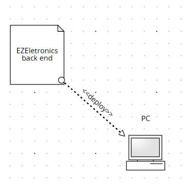

# Requirements Document - current EZElectronics

Date:

Version: V1 - description of EZElectronics in CURRENT form (as received by teachers)

| Version number | Change                                              |
| :------------: | :-------------------------------------------------- |
|      1.0       | Versione iniziale                                   |
|      1.1       | Aggiunti stakeholders e context diagram             |
|      1.2       | Aggiunte interfacce e user stories                  |
|      1.3       | Aggiunti requisiti funzionali e non funzionali      |
|      1.4       | Aggiunto diagramma dei casi d’uso ed alcuni scenari |
|      1.5       | Aggiunti scenari aggiuntivi                         |
|      1.6       | Aggiornato diagramma dei casi d'uso                 |
|      1.7       | Aggiornato deployment diagram                       |

## Contents

* [Informal description](#informal-description)
   * [Stakeholders](#stakeholders)
   * [Context Diagram and interfaces](#context-diagram-and-interfaces)
      + [Context Diagram](#context-diagram)
      + [Interfaces](#interfaces)
   * [Stories and personas](#stories-and-personas)
   * [Functional and non functional requirements](#functional-and-non-functional-requirements)
      + [Functional Requirements](#functional-requirements)
      + [Table of rights](#table-of-rights)
      + [Non Functional Requirements](#non-functional-requirements)
   * [Use case diagram and use cases](#use-case-diagram-and-use-cases)
      + [Use case diagram](#use-case-diagram)
      + [Use cases](#use-cases)
         - [UC1 - Creazione account](#uc1-creazione-account)
            * [Scenario 1.1](#scenario-11)
            * [Scenario 1.2](#scenario-12)
         - [UC2 - Login](#uc2-login)
            * [Scenario 2.1](#scenario-21)
            * [Scenario 2.2](#scenario-22)
         - [UC3 - Logout](#uc3-logout)
            * [Scenario 3.1](#scenario-31)
         - [UC4 - Visualizza informazioni profilo](#uc4-visualizza-informazioni-profilo)
            * [Scenario 4.1](#scenario-41)
         - [UC5 - Aggiunta di un prodotto al carrello](#uc5-aggiunta-di-un-prodotto-al-carrello)
            * [Scenario 5.1](#scenario-51)
            * [Scenario 5.2](#scenario-52)
         - [UC6 - Rimozione di un prodotto dal carrello](#uc6-rimozione-di-un-prodotto-dal-carrello)
            * [Scenario 6.1](#scenario-61)
            * [Scenario 6.2](#scenario-62)
         - [UC7 - Visualizzazione del carrello](#uc7-visualizzazione-del-carrello)
            * [Scenario 7.1](#scenario-71)
         - [UC8 - Svuotamento del carrello](#uc8-svuotamento-del-carrello)
            * [Scenario 8.1](#scenario-81)
         - [UC9 - Pagamento del carrello](#uc9-pagamento-del-carrello)
            * [Scenario 9.1](#scenario-91)
            * [Scenario 9.2](#scenario-92)
            * [Scenario 9.3](#scenario-93)
         - [UC10 - Visualizzazione degli ordini passati](#uc10-visualizzazione-degli-ordini-passati)
            * [Scenario 10.1](#scenario-101)
         - [UC11 - Registrazione nuovo prodotto](#uc11-registrazione-nuovo-prodotto)
            * [Scenario 11.1](#scenario-111)
            * [Scenario 11.2](#scenario-112)
         - [UC12 - Registrazione set di prodotti](#uc12-registrazione-set-di-prodotti)
            * [Scenario 12.1](#scenario-121)
         - [UC13 - Eliminazione di un prodotto](#uc13-eliminazione-di-un-prodotto)
            * [Scenario 13.1](#scenario-131)
            * [Scenario 13.2](#scenario-132)
         - [UC14 - Segnalazione prodotto come venduto](#uc14-segnalazione-prodotto-come-venduto)
            * [Scenario 14.1](#scenario-141)
            * [Scenario 14.2](#scenario-142)
            * [Scenario 14.3](#scenario-143)
         - [UC15 - Ricerca prodotti](#uc15-ricerca-prodotti)
            * [Scenario 15.1](#scenario-151)
            * [Scenario 15.2](#scenario-152)
            * [Scenario 15.3](#scenario-153)
            * [Scenario 15.4](#scenario-154)
            * [Scenario 15.5](#scenario-155)
         - [UC16 - Filtraggio dei prodotti](#uc16-filtraggio-dei-prodotti)
            * [Scenario 16.1](#scenario-161)
            * [Scenario 16.2](#scenario-162)
            * [Scenario 16.3](#scenario-163)
   * [Glossary](#glossary)
   * [System Design](#system-design)
- [Deployment Diagram](#deployment-diagram)
   * [Analisi dei difetti](#analisi-dei-difetti)

## Informal description

EZElectronics (read EaSy Electronics) is a software application designed to help managers of electronics stores to manage their products and offer them to customers through a dedicated website. Managers can assess the available products, record new ones, and confirm purchases. Customers can see available products, add them to a cart and see the history of their past purchases.

## Stakeholders

| Stakeholder name                  | Description                                                  |
| :-------------------------------- | :----------------------------------------------------------- |
| Cliente                           | Utente finale che utilizza l'applicazione per acquistare prodotti elettronici attraverso il sito web dedicato. |
| Proprietario negozio / Manager    | Gestore del negozio di elettronica che utilizza l'applicazione per gestire i prodotti e le vendite del negozio. |
| Fornitore servizio di database    | Azienda che fornisce il servizio di database utilizzato dall'applicazione per memorizzare e gestire i dati dei prodotti, degli utenti e delle transazioni. |
| Fornitore servizio di hosting web | Azienda che fornisce il servizio di hosting su cui è ospitato il sito web dell'applicazione, garantendo la sua disponibilità e accessibilità online. |

## Context Diagram and interfaces

### Context Diagram

### Interfaces

|       Actor        |        Logical Interface         | Physical Interface |
| :----------------: | :------------------------------: | :----------------: |
| Cliente (customer) |      GUI (desktop o mobile)      |  Smartphone / PC   |
|      Manager       |      GUI (desktop o mobile)      |  Smartphone / PC   |
| Database provider  | https://www.postgresql.org/docs/ |      Internet      |
|  Hosting provider  |  https://docs.digitalocean.com/  |      Internet      |

## Stories and personas

**Nome**: Marco
**Ruolo**: Manager del negozio
**Background**: Marco ha una vasta esperienza nel settore della vendita al dettaglio e ha appena assunto la gestione del negozio di elettronica. Desidera ottimizzare le operazioni del negozio e migliorare l'esperienza dei clienti.
Marco ha notato che il processo di gestione dei prodotti nel negozio è inefficiente e porta a errori nella tenuta dell'inventario. Decide di utilizzare EZElectronics per semplificare il processo di gestione dei prodotti e migliorare l'efficienza complessiva del negozio. Utilizzando EZElectronics, Marco può facilmente registrare nuovi prodotti nel sistema, tenere traccia delle quantità disponibili e monitorare le vendite in tempo reale.

**Nome**: Martina, 41 anni, sposata
**Ruolo**: Cliente Occasionale
**Background**: Martina non è particolarmente esperta di tecnologia ma cerca comunque prodotti affidabili e convenienti per il suo uso quotidiano. Si affida spesso ai consigli del personale del negozio quando acquista dispositivi elettronici.
Martina ha bisogno di acquistare un nuovo laptop per suo figlio, che inizia a frequentare la scuola media. Utilizzando EZElectronics, può esplorare i diversi laptop disponibili nel negozio e confrontare le loro caratteristiche e prezzi. Dopo aver trovato un laptop adatto alle esigenze di suo figlio, aggiunge il prodotto al carrello e procede al checkout. Durante il processo di acquisto, apprezza la chiarezza e la semplicità dell'interfaccia utente di EZElectronics, che le permette di completare l'acquisto senza problemi.

## Functional and non functional requirements

### Functional Requirements

|   ID    | Description                                                  |
| :-----: | :----------------------------------------------------------- |
| **FR1** | Gestione del carrello                                        |
|  FR1.1  | Un Cliente deve poter aggiungere un prodotto al carrello     |
|  FR1.2  | Un Cliente deve poter eliminare un prodotto al carrello      |
|  FR1.3  | Un Cliente deve poter visualizzare il proprio carrello       |
|  FR1.4  | Un Cliente deve poter svuotare il proprio carrello           |
|  FR1.5  | Un Cliente deve poter effettuare il check out del proprio carrello |
|  FR1.6  | Un Cliente deve poter visualizzare la cronologia dei carrelli già pagati in passato (ovvero gli acquisti precedenti) |
| **FR2** | Gestione degli utenti                                        |
|  FR2.1  | Un utente deve essere in grado di creare un proprio account personale con il ruolo di Customer o Manager |
|  FR2.2  | Un utente deve essere in grado di effettuare il login alla piattaforma |
|  FR2.3  | Un utente deve essere in grado di effettuare il logout dalla piattaforma |
|  FR2.4  | Un utente deve essere in grado di reperire le informazioni sul proprio account |
| **FR3** | Gestione dei prodotti                                        |
|  FR3.1  | Un Manager deve essere in grado di registrare un nuovo prodotto |
|  FR3.2  | Un Manager deve essere in grado di registrare l’arrivo di un set di prodotti (ovvero più prodotti dello stesso modello) |
|  FR3.3  | Un Manager deve essere in grado di cancellare un prodotto esistente |
|  FR3.4  | Un Manager deve poter segnare un prodotto come venduto       |
| **FR4** | Visualizzazione dei prodotti                                 |
|  FR4.1  | Un utente deve essere in grado di visualizzare la lista di tutti i prodotti |
|  FR4.2  | Un utente deve essere in grado di visualizzare uno specifico prodotto tramite il suo codice |
|  FR4.3  | Un utente deve essere in grado di visualizzare tutti i prodotti appartenenti ad una specifica categoria |
|  FR4.4  | Un utente deve essere in grado di visualizzare tutti i prodotti dello stesso modello |
|  FR4.5  | Un utente deve essere in grado di filtrare i prodotti che sono stati venduti da quelli disponibili |

### Table of rights

|   ID    | Cliente | Manager |
| :-----: | :-----: | :-----: |
| **FR1** |    X    |         |
|  FR1.1  |    X    |         |
|  FR1.2  |    X    |         |
|  FR1.3  |    X    |         |
|  FR1.4  |    X    |         |
|  FR1.5  |    X    |         |
|  FR1.6  |    X    |         |
| **FR2** |    X    |    X    |
|  FR2.1  |    X    |    X    |
|  FR2.2  |    X    |    X    |
|  FR2.3  |    X    |    X    |
|  FR2.4  |    X    |    X    |
| **FR3** |         |    X    |
|  FR3.1  |         |    X    |
|  FR3.2  |         |    X    |
|  FR3.3  |         |    X    |
|  FR3.4  |         |    X    |
| **FR4** |    X    |    X    |
|  FR4.1  |    X    |    X    |
|  FR4.2  |    X    |    X    |
|  FR4.3  |    X    |    X    |
|  FR4.4  |    X    |    X    |
|  FR4.5  |    X    |    X    |

### Non Functional Requirements

|  ID   |      Type      | Description                                                  | Refers to  |
| :---: | :------------: | :----------------------------------------------------------- | :--------: |
| NFR1  |  portabilità   | il sito web deve funzionare correttamente almeno sulle ultime due versioni dei principali browsers (Safari, Chrome, Firefox, Opera, Brave) | Tutti i FR |
| NFR2  |  portabilità   | l'applicazione deve essere sviluppata utilizzando tecnologie e framework cross-platform per garantire la sua esecuzione su diverse piattaforme | Tutti i FR |
| NFR3  |   usabilità    | l’interfaccia grafica (GUI) deve essere intuitiva ed usabile dagli utenti senza bisogno di training specifico | Tutti i FR |
| NFR4  |   usabilità    | il sito web dedicato deve essere progettato con un layout responsive che si adatti automaticamente a diverse dimensioni di schermo, garantendo un'esperienza utente ottimale su dispositivi desktop, tablet e smartphone. | Tutti i FR |
| NFR5  |   efficienza   | il caricamento delle pagine deve richiedere meno di 200ms (escluso la connessione di rete) | Tutti i FR |
| NFR6  |   efficienza   | l'applicazione deve essere in grado di gestire un elevato numero di transazioni simultanee senza compromettere le prestazioni (almeno 5000). | Tutti i FR |
| NFR7  |  affidabilità  | il sito web deve mantenere memorizzate le informazioni (es: stato del carrello) |   FR1.3    |
| NFR8  |  affidabilità  | l'applicazione deve essere progettata per essere resistente ai guasti e per garantire la disponibilità continua del servizio, con un obiettivo di uptime del 99%. | Tutti i FR |
| NFR9  |   sicurezza    | tutte le comunicazioni tra l'applicazione e i server devono essere crittografate utilizzando protocolli sicuri come HTTPS per proteggere i dati degli utenti durante la trasmissione | Tutti i FR |
| NFR10 | manutenibilità | l’applicazione dovrebbe avere il minor numero di bug possibile in modo che gli utenti non segnalino più di tre problemi all’anno | Tutti i FR |

## Use case diagram and use cases

### Use case diagram

### Use cases

#### UC1 - Creazione account

| **Actors Involved** | **Cliente, Manager**      |
| ------------------- | ------------------------- |
| Precondition        | L’utente non è registrato |
| Post condition      | L’utente è registrato     |
| Nominal Scenario    | Scenario 1.1              |
| Variants            | Nessuna                   |
| Exceptions          | Scenario 1.2              |

##### Scenario 1.1

| **Scenario 1.1** | **Registrazione**                                            |
| ---------------- | ------------------------------------------------------------ |
| Precondition     | L’utente non è registrato                                    |
| Post condition   | L'utente è registrato                                        |
| Step#            | Description                                                  |
| 1                | L’utente chiede di registrarsi                               |
| 2                | Il sistema chiede nome, cognome, username, password e ruolo  |
| 3                | L’utente inserisce i dati richiesti                          |
| 4                | Il sistema acquisisce i dati inseriti                        |
| 5                | Il sistema controlla che l’username non sia associato a un account esistente |
| 6                | Il sistema salva i dati e registra l’utente                  |

##### Scenario 1.2

| **Scenario 1.2** | **Username già registrato**                                  |
| ---------------- | ------------------------------------------------------------ |
| Precondition     | L’utente non è registrato, l'username inserito è gia registrato nel sistema |
| Post condition   | L'utente non è registrato                                    |
| Step#            | Description                                                  |
| 1                | L’utente chiede di registrarsi                               |
| 2                | Il sistema chiede nome, cognome, username, password e ruolo  |
| 3                | L’utente inserisce i dati richiesti                          |
| 4                | Il sistema acquisisce i dati inseriti                        |
| 5                | Il sistema controlla che l’username non sia associato a un account esistente |
| 6                | Il nome utente è già associato a un account e il sistema restituisce un errore |

#### UC2 - Login

| **Actors Involved** | **Cliente, Manager**                |
| ------------------- | ----------------------------------- |
| Precondition        | L’utente è registrato e non loggato |
| Post condition      | L’utente è loggato                  |
| Nominal Scenario    | Scenario 2.1                        |
| Variants            | Nessuna                             |
| Exceptions          | Scenario 2.2, 2.3                   |

##### Scenario 2.1

| **Scenario 2.1** | **Utente loggato con successo**                              |
| ---------------- | ------------------------------------------------------------ |
| Precondition     | L’utente è registrato e non loggato                          |
| Post condition   | L’utente è loggato                                           |
| Step#            | Description                                                  |
| 1                | L’utente chiede di loggarsi                                  |
| 2                | Il sistema chiede nome utente e password                     |
| 3                | L’utente inserisce nome utente e password                    |
| 4                | Il sistema acquisisce i dati inseriti                        |
| 5                | Il sistema controlla che l’username sia associato a un account esistente e la password corrisponda |
| 6                | Il sistema autentica l’utente                                |

##### Scenario 2.2

| **Scenario 2.2** | **Credenziali errate**                                       |
| ---------------- | ------------------------------------------------------------ |
| Precondition     | L’utente è registrato e non loggato                          |
| Post condition   | L’utente non è loggato                                       |
| Step#            | Description                                                  |
| 1                | L’utente chiede di loggarsi                                  |
| 2                | Il sistema chiede nome utente e password                     |
| 3                | L’utente inserisce nome utente e password                    |
| 4                | Il sistema acquisisce i dati inseriti                        |
| 5                | Il sistema controlla che l’username sia associato a un account esistente e la password corrisponda |
| 6                | Il sistema vede che le credenziali sono errate e restituisce errore |

#### UC3 - Logout

| **Actors Involved** | **Cliente, Manager**   |
| ------------------- | ---------------------- |
| Precondition        | L’utente è loggato     |
| Postcondition       | L’utente non è loggato |
| Nominal Scenario    | Scenario 3.1           |
| Variants            | Nessuna                |
| Exceptions          | Nessuna                |

##### Scenario 3.1

| **Scenario 3.1** | **Utente disconnesso con successo**                          |
| ---------------- | ------------------------------------------------------------ |
| Precondition     | L’utente è loggato                                           |
| Post condition   | L’utente non è loggato                                       |
| Step#            | Description                                                  |
| 1                | L’utente chiede di eseguire il logout                        |
| 2                | Il sistema verifica che l’utente sia loggato                 |
| 3                | Il sistema esegue il logout dell'utente, invalidando la sessione attuale |
| 4                | Il sistema mostra un messaggio di conferma di avvenuta disconnessione |

#### UC4 - Visualizza informazioni profilo

| **Actors Involved** | **Cliente, Manager**                                |
| ------------------- | --------------------------------------------------- |
| Precondition        | L’utente è loggato                                  |
| Postcondition       | L’utente visualizza le informazioni sul suo profilo |
| Nominal Scenario    | Scenario 4.1                                        |
| Variants            | Nessuna                                             |
| Exceptions          | Nessuna                                             |

##### Scenario 4.1

| **Scenario 4.1** | **Utente visualizza informazioni profilo**                   |
| ---------------- | ------------------------------------------------------------ |
| Precondition     | L’utente è loggato                                           |
| Post condition   | L’utente visualizza le informazioni sul suo profilo          |
| Step#            | Description                                                  |
| 1                | L’utente richiede al sistema le informazioni sul proprio profilo |
| 2                | Il sistema verifica che l’utente sia loggato                 |
| 3                | Il sistema restituisce le informazioni sul profilo dell'utente |

#### UC5 - Aggiunta di un prodotto al carrello

| **Actors Involved** | **Cliente**                                        |
| ------------------- | -------------------------------------------------- |
| Precondition        | Il cliente è loggato                               |
| Postcondition       | Un prodotto viene aggiunto al carrello del cliente |
| Nominal Scenario    | Scenario 5.1                                       |
| Variants            | Nessuna                                            |
| Exceptions          | Scenario 5.2                                       |

##### Scenario 5.1

| **Scenario 5.1** | **Prodotto aggiunto con successo**                      |
| ---------------- | ------------------------------------------------------- |
| Precondition     | Il cliente è loggato                                    |
| Post condition   | Un prodotto viene aggiunto al carrello del cliente      |
| Step#            | Description                                             |
| 1                | Il cliente chiede di aggiungere un prodotto al carrello |
| 2                | Il sistema verifica che il cliente sia loggato          |
| 3                | Il sistema verifica che il prodotto sia disponibile     |
| 4                | Il sistema aggiunge il prodotto al carrello del cliente |

##### Scenario 5.2

| **Scenario 5.2** | **Prodotto non disponibile**                                 |
| ---------------- | ------------------------------------------------------------ |
| Precondition     | Il cliente è loggato                                         |
| Post condition   | Il prodotto non viene aggiunto al carrello                   |
| Step#            | Description                                                  |
| 1                | Il cliente chiede di aggiungere un prodotto al carrello      |
| 2                | Il sistema verifica che il cliente sia loggato               |
| 3                | Il sistema verifica che il prodotto sia disponibile          |
| 4                | Il sistema riconosce che il prodotto non è disponibile e visualizza un messaggio d’errore |

#### UC6 - Rimozione di un prodotto dal carrello

| **Actors Involved** | **Cliente**                                      |
| ------------------- | ------------------------------------------------ |
| Precondition        | Il cliente è loggato                             |
| Postcondition       | Il prodotto X è rimosso dal carrello del cliente |
| Nominal Scenario    | Scenario 6.1                                     |
| Variants            | Nessuna                                          |
| Exceptions          | Scenario 6.2                                     |

##### Scenario 6.1

| **Scenario 6.1** | **Prodotto rimosso con successo**                            |
| ---------------- | ------------------------------------------------------------ |
| Precondition     | Il cliente è loggato                                         |
| Post condition   | Il prodotto X è rimosso dal carrello del cliente             |
| Step#            | Description                                                  |
| 1                | Il cliente chiede di rimuovere un prodotto X dal carrello    |
| 2                | Il sistema verifica che il cliente sia loggato e che il prodotto X sia presente nel suo carrello |
| 3                | Il sistema rimuove il prodotto X dal carrello del cliente    |

##### Scenario 6.2

| **Scenario 6.2** | **Prodotto non presente nel carrello**                       |
| ---------------- | ------------------------------------------------------------ |
| Precondition     | Il cliente è loggato                                         |
| Post condition   | Il prodotto non è rimosso dal carrello del cliente           |
| Step#            | Description                                                  |
| 1                | Il cliente chiede di rimuovere un prodotto al carrello       |
| 2                | Il sistema verifica che il cliente sia loggato e che il prodotto X sia presente nel suo carrello |
| 3                | Il sistema riconosce che il prodotto non si trova nel carrello e mostra un messaggio d’errore |

#### UC7 - Visualizzazione del carrello

| **Actors Involved** | **Cliente**                               |
| ------------------- | ----------------------------------------- |
| Precondition        | Il cliente è loggato                      |
| Postcondition       | La pagina del carrello viene visualizzata |
| Nominal Scenario    | Scenario 7.1                              |
| Variants            | Nessuna                                   |
| Exceptions          | Nessuna                                   |

##### Scenario 7.1

| **Scenario 7.1** | **Carrello visualizzato con successo**                       |
| ---------------- | ------------------------------------------------------------ |
| Precondition     | Il cliente è loggato                                         |
| Post condition   | La pagina del carrello viene visualizzata                    |
| Step#            | Description                                                  |
| 1                | Il cliente chiede di visualizzare il carrello                |
| 2                | Il sistema verifica che il cliente sia loggato               |
| 3                | Il sistema restituisce i prodotti contenuti nel carrello del cliente |

#### UC8 - Svuotamento del carrello

| **Actors Involved** | **Cliente**                                               |
| ------------------- | --------------------------------------------------------- |
| Precondition        | Il cliente è loggato                                      |
| Postcondition       | Tutti i prodotti all'interno del carrello vengono rimossi |
| Nominal Scenario    | Scenario 8.1                                              |
| Variants            | Nessuna                                                   |
| Exceptions          | Nessuna                                                   |

##### Scenario 8.1

| **Scenario 8.1** | **Carrello svuotato**                                        |
| ---------------- | ------------------------------------------------------------ |
| Precondition     | Il cliente è loggato                                         |
| Post condition   | Tutti i prodotti all'interno del carrello vengono rimossi    |
| Step#            | Description                                                  |
| 1                | Il cliente chiede di svuotare il carrello                    |
| 2                | Il sistema verifica che il cliente sia loggato               |
| 3                | Il sistema rimuove tutti i prodotti presenti nel carrello del cliente |

#### UC9 - Pagamento del carrello

| **Actors Involved** | **Cliente**                                                  |
| ------------------- | ------------------------------------------------------------ |
| Precondition        | Il cliente è loggato                                         |
| Postcondition       | Il carrello è vuoto e tutti i prodotti al suo interno vengono segnati come venduti |
| Nominal Scenario    | Scenario 9.1                                                 |
| Variants            | Nessuna                                                      |
| Exceptions          | Scenari 9.2, 9.3                                             |

##### Scenario 9.1

| **Scenario 9.1** | **Checkout completato**                                      |
| ---------------- | ------------------------------------------------------------ |
| Precondition     | Il cliente è loggato                                         |
| Post condition   | Il carrello è vuoto e tutti i prodotti al suo interno vengono segnati come venduti |
| Step#            | Description                                                  |
| 1                | Il cliente chiede al sistema di effettuare il checkout del proprio carrello |
| 2                | Il sistema verifica che il cliente sia loggato               |
| 3                | Il sistema verifica che il carrello non sia vuoto            |
| 4                | Il sistema verifica che il carrello non contenga prodotti già venduti |
| 5                | Il sistema calcola il totale del carrello e lo segna come pagato |
| 6                | Il sistema segna tutti i prodotti contenuti nel carrello come venduti |
| 7                | Il sistema svuota il carrello                                |
| 8                | Il sistema ritorna un messaggio di avvenuto checkout         |

##### Scenario 9.2

| **Scenario 9.2** | **Carrello vuoto**                                           |
| ---------------- | ------------------------------------------------------------ |
| Precondition     | Il cliente è loggato                                         |
| Postcondition    | Il checkout fallisce                                         |
| Step#            | Description                                                  |
| 1                | Il cliente chiede al sistema di effettuare il checkout del proprio carrello |
| 2                | Il sistema verifica che l’utente sia loggato                 |
| 3                | Il sistema verifica che il carrello non sia vuoto            |
| 4                | Il sistema segnala al cliente che il carrello è vuoto con un messaggio di errore |

##### Scenario 9.3

| **Scenario 9.3** | **Uno o più prodotti già venduti**                           |
| ---------------- | ------------------------------------------------------------ |
| Precondition     | Il cliente è loggato e il carrello non è vuoto               |
| Postcondition    | Il checkout fallisce                                         |
| Step#            | Description                                                  |
| 1                | Il cliente chiede al sistema di effettuare il checkout del proprio carrello |
| 2                | Il sistema verifica che il cliente sia loggato               |
| 3                | Il sistema verifica che il carrello non sia vuoto            |
| 4                | Il sistema verifica che il carrello non contenga prodotti già venduti |
| 5                | Il sistema segnala al cliente che il suo carrello contiene dei prodotti già venduti con un messaggio di errore |

#### UC10 - Visualizzazione degli ordini passati

| **Actors Involved** | **Cliente**                                              |
| ------------------- | -------------------------------------------------------- |
| Precondition        | Il cliente è loggato                                     |
| Postcondition       | Il cliente visualizza lo storico degli ordini effettuati |
| Nominal Scenario    | Scenario 10.1                                            |
| Variants            | Nessuna                                                  |
| Exceptions          | Nessuna                                                  |

##### Scenario 10.1

| **Scenario 10.1** | **Storico ordini visualizzato con successo**                 |
| ----------------- | ------------------------------------------------------------ |
| Precondition      | Il cliente è loggato                                         |
| Post condition    | Il cliente visualizza lo storico degli ordini effettuati     |
| Step#             | Description                                                  |
| 1                 | Il cliente richiede di visualizzare lo storico degli ordini  |
| 2                 | Il sistema verifica che il cliente sia loggato               |
| 3                 | Il sistema restituisce la lista dei carrelli già pagati dal cliente |

#### UC11 - Registrazione nuovo prodotto

| **Actors Involved** | **Manager**                  |
| ------------------- | ---------------------------- |
| Precondition        | Il manager è loggato         |
| Postcondition       | Il prodotto viene registrato |
| Nominal Scenario    | Scenario 11.1                |
| Variants            | Nessuna                      |
| Exceptions          | Scenario 11.2                |

##### Scenario 11.1

| **Scenario 11.1** | **Prodotto aggiunto con successo**                           |
| ----------------- | ------------------------------------------------------------ |
| Precondition      | Il manager è loggato                                         |
| Post condition    | Il prodotto viene registrato                                 |
| Step#             | Description                                                  |
| 1                 | Il manager richiede di registrare un nuovo prodotto          |
| 2                 | Il sistema verifica che il manager sia loggato               |
| 3                 | Il sistema richiede i dati necessari (id, modello, categoria, prezzo di vendita, data di arrivo e dettagli) |
| 4                 | Il sistema controlla la validità dei dati e l’univocità dell’id |
| 5                 | Il sistema registra il prodotto e mostra un messaggio di conferma |

##### Scenario 11.2

| **Scenario 11.2** | **ID prodotto non univoco**                                  |
| ----------------- | ------------------------------------------------------------ |
| Precondition      | Il manager è loggato                                         |
| Post condition    | Il prodotto non è aggiunto al database                       |
| Step#             | Description                                                  |
| 1                 | Il manager richiede di registrare un nuovo prodotto          |
| 2                 | Il sistema verifica che il manager sia loggato               |
| 3                 | Il sistema richiede i dati necessari (id, modello, categoria, prezzo di vendita, data di arrivo e dettagli) |
| 4                 | Il sistema controlla la validità dei dati e l’univocità dell’id |
| 5                 | Il sistema nota che l'id fornito è associato ad un prodotto già esistente |
| 6                 | Il sistema non registra il prodotto e ritorna un messaggio di errore |

#### UC12 - Registrazione set di prodotti

| **Actors Involved** | **Manager**                     |
| ------------------- | ------------------------------- |
| Precondition        | Il manager è loggato            |
| Postcondition       | Il set di prodotti è registrato |
| Nominal Scenario    | Scenario 12.1                   |
| Variants            | Nessuna                         |
| Exceptions          | Nessuna                         |

##### Scenario 12.1

| **Scenario 12.1** | **Set di prodotti registrato con successo**                  |
| ----------------- | ------------------------------------------------------------ |
| Precondition      | Il manager è loggato                                         |
| Post condition    | Il set di prodotti è registrato                              |
| Step#             | Description                                                  |
| 1                 | Il manager richiede di registrare l’arrivo di un set di prodotti |
| 2                 | Il sistema verifica che il manager sia loggato               |
| 3                 | Il sistema richiede i dati necessari per il set di prodotti (quantità, categoria, data di arrivo, dettagli) |
| 4                 | Il sistema registra il set di prodotti e mostra un messaggio di conferma |

#### UC13 - Eliminazione di un prodotto

| **Actors Involved** | **Manager**             |
| ------------------- | ----------------------- |
| Precondition        | Il manager è loggato    |
| Postcondition       | Il prodotto è eliminato |
| Nominal Scenario    | Scenario 13.1           |
| Variants            | Nessuna                 |
| Exceptions          | Scenario 13.2           |

##### Scenario 13.1

| **Scenario 13.1** | **Prodotto eliminato con successo**                          |
| ----------------- | ------------------------------------------------------------ |
| Precondition      | Il manager è loggato                                         |
| Post condition    | Il prodotto è eliminato                                      |
| Step#             | Description                                                  |
| 1                 | Il manager richiede di eliminare un prodotto con un certo id |
| 2                 | Il sistema verifica che il manager sia loggato               |
| 3                 | Il sistema controlla l’esistenza del prodotto con il dato id |
| 4                 | Il sistema rimuove il prodotto e ritorna un messaggio di conferma |

##### Scenario 13.2

| **Scenario 13.2** | **ID del prodotto non esistente**                            |
| ----------------- | ------------------------------------------------------------ |
| Precondition      | Il manager è loggato                                         |
| Post condition    | Il prodotto non è eliminato                                  |
| Step#             | Description                                                  |
| 1                 | Il manager richiede di eliminare un prodotto con un certo id |
| 2                 | Il sistema verifica che il manager sia loggato               |
| 3                 | Il sistema controlla l’esistenza del prodotto con il dato id |
| 4                 | Il sistema non trova un prodotto con l'id fornito e restituisce un messaggio di errore |

#### UC14 - Segnalazione prodotto come venduto

| **Actors Involved** | **Manager**                        |
| ------------------- | ---------------------------------- |
| Precondition        | Il manager è loggato               |
| Postcondition       | Il prodotto è segnato come venduto |
| Nominal Scenario    | Scenario 14.1                      |
| Variants            | Nessuna                            |
| Exceptions          | Scenario 14.2, 14.3                |

##### Scenario 14.1

| **Scenario 14.1** | **Prodotto segnato come venduto**                            |
| ----------------- | ------------------------------------------------------------ |
| Precondition      | Il manager è loggato                                         |
| Post condition    | Il prodotto è segnato come venduto                           |
| Step#             | Description                                                  |
| 1                 | Il manager chiede di segnare un prodotto con un certo id come venduto |
| 2                 | Il sistema verifica che il manager sia loggato               |
| 3                 | Il sistema controlla l’esistenza del prodotto con il dato id |
| 4                 | Il sistema segna il prodotto come venduto e ritorna un messaggio di conferma |

##### Scenario 14.2

| **Scenario 14.2** | **ID del prodotto non esistente**                            |
| ----------------- | ------------------------------------------------------------ |
| Precondition      | Il manager è loggato                                         |
| Post condition    | Il prodotto non è segnato come venduto                       |
| Step#             | Description                                                  |
| 1                 | Il manager chiede di segnare un prodotto con un certo id come venduto |
| 2                 | Il sistema verifica che il manager sia loggato               |
| 3                 | Il sistema controlla l’esistenza del prodotto con il dato id |
| 4                 | Il sistema non trova un prodotto con l'id fornito e resistuisce un messaggio di errore |

##### Scenario 14.3

| **Scenario 14.3** | **Prodotto già venduto**                                     |
| ----------------- | ------------------------------------------------------------ |
| Precondition      | Il manager è loggato e il prodotto è presente nel sistema    |
| Post condition    | Il prodotto non è segnato come venduto                       |
| Step#             | Description                                                  |
| 1                 | Il manager chiede di segnare un prodotto con un certo id come venduto |
| 2                 | Il sistema verifica che il manager sia loggato               |
| 3                 | Il sistema controlla l’esistenza del prodotto con il dato id |
| 4                 | Il sistema nota che il prodotto indicato è gia stato segnato come venduto e ritorna un messaggio di errore |

#### UC15 - Ricerca prodotti

| Actors Involved  | Cliente, Manager                         |
| :--------------: | :--------------------------------------- |
|   Precondition   | L'utente è loggato                       |
|  Post condition  | La lista dei prodotti viene visualizzata |
| Nominal Scenario | Scenario 15.1                            |
|     Variants     | Scenario 15.2, 15.3, 15.4                |
|    Exceptions    | Scenario 15.5                            |

##### Scenario 15.1

| Scenario 15.1  | Ricerca prodotti                                      |
| :------------: | :---------------------------------------------------- |
|  Precondition  | L'utente è loggato                                    |
| Post condition | La lista dei prodotti viene visualizzata              |
|     Step#      | Description                                           |
|       1        | L'utente chiede di visualizzare la lista dei prodotti |
|       2        | Il sistema verifica che l'utente sia loggato          |
|       3        | Il sistema restituisce la lista dei prodotti          |

##### Scenario 15.2

| Scenario 15.2  | Ricerca prodotto per categoria                               |
| :------------: | :----------------------------------------------------------- |
|  Precondition  | L'utente è loggato                                           |
| Post condition | La lista dei prodotti appartenenti ad una categoria C viene visualizzata |
|     Step#      | Description                                                  |
|       1        | L'utente chiede di visualizzare la lista dei prodotti appartenenti alla categoria C |
|       2        | Il sistema verifica che l'utente sia loggato                 |
|       3        | Il sistema restituisce la lista dei prodotti appartenenti alla categoria C |

##### Scenario 15.3

| Scenario 15.3  | Ricerca prodotto per modello                                 |
| :------------: | :----------------------------------------------------------- |
|  Precondition  | L'utente è loggato                                           |
| Post condition | La lista dei prodotti con modello M viene visualizzata       |
|     Step#      | Description                                                  |
|       1        | L'utente chiede di visualizzare la lista dei prodotti con modello M |
|       2        | Il sistema verifica che l'utente sia loggato                 |
|       3        | Il sistema restituisce la lista dei prodotti con modello M   |

##### Scenario 15.4

| Scenario 15.4  | Visualizzazione di un singolo prodotto                       |
| :------------: | :----------------------------------------------------------- |
|  Precondition  | L'utente è loggato                                           |
| Post condition | Le informazioni del prodotto P vengono mostrate              |
|     Step#      | Description                                                  |
|       1        | L'utente chiede di visualizzare le informazioni del prodotto P |
|       2        | Il sistema verifica che l'utente sia loggato                 |
|       3        | Il sistema verifica che il prodotto P esista                 |
|       4        | Il sistema restituisce le informazioni del prodotto P        |

##### Scenario 15.5

| Scenario 15.5  | Prodotto non esistente                                       |
| :------------: | :----------------------------------------------------------- |
|  Precondition  | L'utente è loggato                                           |
| Post condition | L'operazione fallisce con un errore                          |
|     Step#      | Description                                                  |
|       1        | L'utente chiede di visualizzare le informazioni del prodotto P |
|       2        | Il sistema verifica che l'utente sia loggato                 |
|       3        | Il sistema verifica che il prodotto P esista                 |
|       4        | Il sistema non trova il prodotto P e restituisce un messaggio di errore |

#### UC16 - Filtraggio dei prodotti

| Actors Involved  | Cliente, Manager                                             |
| :--------------: | :----------------------------------------------------------- |
|   Precondition   | L'utente è loggato                                           |
|  Post condition  | La lista dei prodotti viene visualizzata con l'applicazione dei filtri selezionati |
| Nominal Scenario | Scenario 16.1                                                |
|     Variants     | Scenario 16.2, 16.3                                          |
|    Exceptions    | Nessuna                                                      |

##### Scenario 16.1

| Scenario 16.1  | Ricerca prodotti                                             |
| :------------: | :----------------------------------------------------------- |
|  Precondition  | L'utente è loggato                                           |
| Post condition | La lista dei prodotti viene visualizzata                     |
|     Step#      | Description                                                  |
|       1        | L'utente chiede di visualizzare la lista dei prodotti        |
|       2        | Il sistema verifica che l'utente sia loggato                 |
|       3        | Il sistema restituisce la lista dei prodotti                 |
|       4        | L'utente seleziona un criterio di filtraggio (venduto / non venduto / nessuno) |
|       5        | Il sistema restituisce la lista dei prodotti che corrisponde ai criteri scelti |

##### Scenario 16.2

| Scenario 16.2  | Ricerca prodotto per categoria                               |
| :------------: | :----------------------------------------------------------- |
|  Precondition  | L'utente è loggato                                           |
| Post condition | La lista dei prodotti appartenenti ad una categoria C viene visualizzata |
|     Step#      | Description                                                  |
|       1        | L'utente chiede di visualizzare la lista dei prodotti appartenenti alla categoria C |
|       2        | Il sistema verifica che l'utente sia loggato                 |
|       3        | Il sistema restituisce la lista dei prodotti appartenenti alla categoria C |
|       4        | L'utente seleziona un criterio di filtraggio (venduto / non venduto / nessuno) |
|       5        | Il sistema restituisce la lista dei prodotti che corrisponde ai criteri scelti |

##### Scenario 16.3

| Scenario 16.3  | Ricerca prodotto per modello                                 |
| :------------: | :----------------------------------------------------------- |
|  Precondition  | L'utente è loggato                                           |
| Post condition | La lista dei prodotti con modello M viene visualizzata       |
|     Step#      | Description                                                  |
|       1        | L'utente chiede di visualizzare la lista dei prodotti con modello M |
|       2        | Il sistema verifica che l'utente sia loggato                 |
|       3        | Il sistema restituisce la lista dei prodotti con modello M   |
|       4        | L'utente seleziona un criterio di filtraggio (venduto / non venduto / nessuno) |
|       5        | Il sistema restituisce la lista dei prodotti che corrisponde ai criteri scelti |

## Glossary

## System Design

# Deployment Diagram

## Analisi dei difetti

- La registrazione di un singolo prodotto all’interno del sistema richiede obbligatoriamente di fornire il codice prodotto, mentre l’API per registrare un set di prodotti dello stesso modello richiede, tra i vari parametri, la quantità dello stock di prodotti, ma non il codice prodotto di ciascuno di essi. Da ciò non si capisce bene dove vengano salvate le informazioni sugli stock arrivati in negozio (non c’è nessun riferimento ad un ipotetico magazzino all’interno del codice) ed in questo modo il manager del negozio dovrebbe registrarli manualmente uno alla volta all’interno del sistema
- In questa versione i clienti hanno la possibilità di effettuare il checkout del proprio carrello, ma l’API non specifica come venga effettuato il pagamento dello stesso visto che non esiste un tracciamento delle transazioni.
- EZElectronics è una piattaforma che consente a diversi negozi di elettronica di registrarsi per vendere i loro prodotti, ma allo stato attuale non esiste un riferimento al singolo negozio. L’unica cosa che li identifica potrebbere essere la presenza di un manager, tuttavia un stesso negozio potrebbe volere più di un manager al suo interno.
- Guardando l’API che gestisce la registrazione degli utenti ci si accorge che non vi è alcun tipo di controllo sulla persona che si registra come manager di un negozio, permettendo a chiunque di assumere tale ruolo. Per risolvere questo problema si potrebbe introdurre una nuova figura, l’amministratore di sistema, che potrebbe incaricarsi di approvare gli account dei presunti manager verificandone l’identità.
- L’API presenta delle rotte di test che permettono di eseguire delle operazioni privilegiate, ma non sono protette da alcun tipo di controllo degli accessi. Il loro accesso dovrebbe essere consentito solo all’amministratore del sistema.
