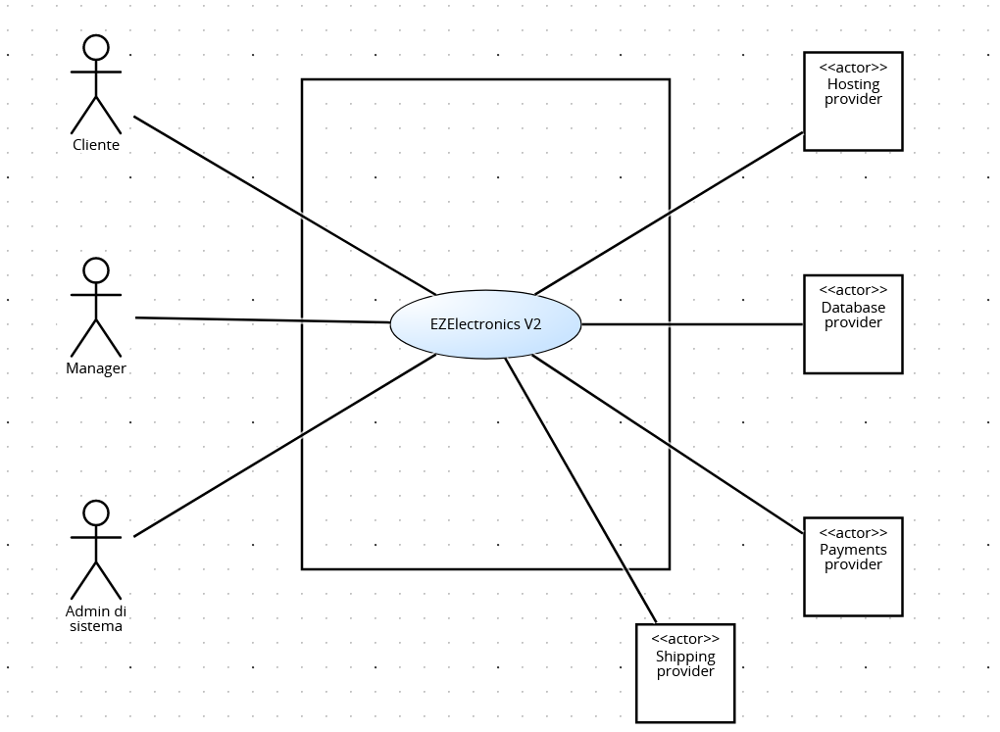
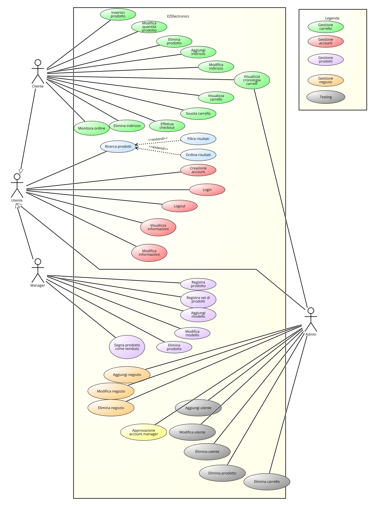
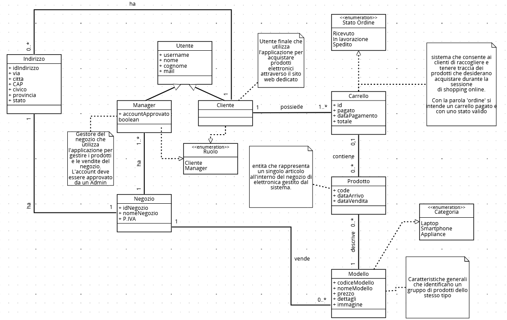

# Requirements Document - current EZElectronics

Date:

Version: V2 - description of EZElectronics 

| Version number |                       Change                        |
| :------------: | :-------------------------------------------------: |
|      1.0       |                  Versione iniziale                  |
| 1.1 | Aggiunti nuovi stakeholders|

# Contents

- [Requirements Document - current EZElectronics](#requirements-document---current-ezelectronics)
- [Contents](#contents)
- [Informal description](#informal-description)
- [Stakeholders](#stakeholders)
- [Context Diagram and interfaces](#context-diagram-and-interfaces)
  - [Context Diagram](#context-diagram)
  - [Interfaces](#interfaces)
- [Stories and personas](#stories-and-personas)
- [Functional and non functional requirements](#functional-and-non-functional-requirements)
  - [Functional Requirements](#functional-requirements)
  - [Table of rights](#table-of-rights)
  - [Non Functional Requirements](#non-functional-requirements)
- [Use case diagram and use cases](#use-case-diagram-and-use-cases)
  - [Use case diagram](#use-case-diagram)
  - [Use cases](#use-cases)
    - [UC1, REGISTRAZIONE](#uc1-registrazione)
      - [Scenario 1.1](#scenario-11)
      - [Scenario 1.2](#scenario-12)
    - [UC2, LOGIN](#uc2-login)
      - [Scenario 2.1](#scenario-21)
      - [Scenario 2.2](#scenario-22)
      - [Scenario 2.3](#scenario-23)
    - [UC3, LOGOUT](#uc3-logout)
      - [Scenario 3.1](#scenario-31)
    - [UC4, AGGIUNTA DI UN PRODOTTO AL CARRELLO](#uc4-aggiunta-di-un-prodotto-al-carrello)
      - [Scenario 4.1](#scenario-41)
      - [Scenario 4.2](#scenario-42)
    - [UC5, RIMOZIONE DI UN PRODOTTO DAL CARRELLO](#uc5-rimozione-di-un-prodotto-dal-carrello)
      - [Scenario 5.1](#scenario-51)
      - [Scenario 5.2](#scenario-52)
      - [Scenario 5.3](#scenario-53)
    - [UC6, VISUALIZZARE IL CARRELLO](#uc6-visualizzare-il-carrello)
      - [Scenario 6.1](#scenario-61)
      - [Scenario 6.2](#scenario-62)
    - [UC7, VISUALIZZAZIONE DEGLI ORDINI PASSATI E DEL PROFILO](#uc7-visualizzazione-degli-ordini-passati-e-del-profilo)
      - [Scenario 7.1](#scenario-71)
      - [Scenario 7.2](#scenario-72)
    - [UC8, REGISTRAZIONE DI UN NUOVO PRODOTTO](#uc8-registrazione-di-un-nuovo-prodotto)
      - [Scenario 8.1](#scenario-81)
      - [Scenario 8.2](#scenario-82)
    - [UC9, REGISTRAZIONE DELL’ARRIVO DI UN SET DI PRODOTTI](#uc9-registrazione-dellarrivo-di-un-set-di-prodotti)
      - [Scenario 9.1](#scenario-91)
    - [UC10, ELIMINAZIONE DI UN PRODOTTO](#uc10-eliminazione-di-un-prodotto)
      - [Scenario 10.1](#scenario-101)
      - [Scenario 10.2](#scenario-102)
    - [UC11, SEGNALAZIONE DI PRODOTTO COME VENDUTO](#uc11-segnalazione-di-prodotto-come-venduto)
      - [Scenario 11.1](#scenario-111)
      - [Scenario 11.2](#scenario-112)
      - [Scenario 11.3](#scenario-113)
    - [UC12, CHECKOUT DEL CARRELLO](#uc12-checkout-del-carrello)
      - [Scenario 12.1](#scenario-121)
      - [Scenario 12.2](#scenario-122)
      - [Scenario 12.3](#scenario-123)
    - [UC13, VISUALIZZAZIONE DEGLI ORDINI DEL NEGOZIO](#uc13-visualizzazione-degli-ordini-del-negozio)
      - [Scenario 13.1](#scenario-131)
    - [UC14, RICERCA PRODOTTI](#uc14-ricerca-prodotti)
      - [Scenario 14.1](#scenario-141)
- [Glossary](#glossary)
- [System Design](#system-design)
- [Deployment Diagram](#deployment-diagram)

# Informal description

EZElectronics (read EaSy Electronics) is a software application designed to help managers of electronics stores to manage their products and offer them to customers through a dedicated website. Managers can assess the available products, record new ones, and confirm purchases. Customers can see available products, add them to a cart and see the history of their past purchases.

# Stakeholders

| Stakeholder            | Description                                                                                                                                                 |
|:------------------------:|:-------------------------------------------------------------------------------------------------------------------------------------------------------------:|
| Cliente                | Utente finale che utilizza l'applicazione per acquistare prodotti elettronici attraverso il sito web dedicato.                                            |
| Proprietario negozio / Manager | Gestore del negozio di elettronica che utilizza l'applicazione per gestire i prodotti e le vendite del negozio.                                           |
| Fornitore servizio di database | Azienda che fornisce il servizio di database utilizzato dall'applicazione per memorizzare e gestire i dati dei prodotti, degli utenti e delle transazioni. |
| Fornitore servizio di hosting web | Azienda che fornisce il servizio di hosting su cui è ospitato il sito web dell'applicazione, garantendo la sua disponibilità e accessibilità online. |
| Fornitore servizio di pagamento | Azienda che fornisce il servizio di pagamento dell’applicazione, garantendo che sia possibile pagare direttamente dall’applicazione i prodotti acquistati. |
| Admin di sistema       | Utente con privilegi massimi che si occupa della manutenibilità dell’applicazione ed è inoltre colui incaricato di fornire gli account di tipo manager.   |
| Fornitore servizio spedizione | Azienda che fornisce il servizio di spedizione, consentendo ai clienti di ricevere i propri prodotti direttamente a casa.                                 |

# Context Diagram and interfaces

## Context Diagram

## Interfaces

| Actor               | Logical interface                     | Physical interface        |
|:----------------------:|:------------------------------------------:|:----------------------------:|
| Cliente     | GUI (desktop o mobile)                   | Smartphone / PC            |
| Manager              | GUI (desktop o mobile)                   | Smartphone / PC            |
| Fornitore del database | [Documentazione PostgreSQL](https://www.postgresql.org/docs/) | Internet                   |
| Fornitore del servizio di hosting | [Documentazione DigitalOcean](https://docs.digitalocean.com/) | Internet                   |
| Fornitore del servizio di pagamento | [Documentazione PayPal](https://developer.paypal.com/home)             | Internet                   |
| Fornitore del servizio di spedizione | [UPS](https://www.ups.com/)                            | Internet                   |
| Admin di sistema    | GUI (desktop o mobile)                   | Smartphone / PC            |

# Stories and personas

**Nome**: Marco
**Ruolo**: Manager del negozio
**Background**: Marco ha una vasta esperienza nel settore della vendita al dettaglio e ha appena assunto la gestione del negozio di elettronica. Desidera ottimizzare le operazioni del negozio e migliorare l'esperienza dei clienti.
Marco ha notato che il processo di gestione dei prodotti nel negozio è inefficiente e porta a errori nella tenuta dell'inventario. Decide di utilizzare EZElectronics per semplificare il processo di gestione dei prodotti e migliorare l'efficienza complessiva del negozio. Utilizzando EZElectronics, Marco può facilmente registrare nuovi prodotti nel sistema, tenere traccia delle quantità disponibili e monitorare le vendite in tempo reale.

**Nome**: Martina, 41 anni, sposata
**Ruolo**: Cliente Occasionale
**Background**: Martina non è particolarmente esperta di tecnologia ma cerca comunque prodotti affidabili e convenienti per il suo uso quotidiano. Si affida spesso ai consigli del personale del negozio quando acquista dispositivi elettronici.
Martina ha bisogno di acquistare un nuovo laptop per suo figlio, che inizia a frequentare la scuola media. Utilizzando EZElectronics, può esplorare i diversi laptop disponibili nel negozio e confrontare le loro caratteristiche e prezzi. Dopo aver trovato un laptop adatto alle esigenze di suo figlio, aggiunge il prodotto al carrello e procede al checkout. Durante il processo di acquisto, apprezza la chiarezza e la semplicità dell'interfaccia utente di EZElectronics, che le permette di completare l'acquisto senza problemi.

# Functional and non functional requirements

## Functional Requirements

| **ID**   | **Description**                                                              |
| :----: | :------------------------------------------------------------------------:|
| **FR1**  | Gestione del carrello                                                    |
| FR1.1 | Un Cliente deve poter aggiungere un prodotto al carrello                |
| FR1.2 | Un Cliente deve poter aggiungere più prodotti dello stesso modello al carrello |
| FR1.3 | Un Cliente deve poter eliminare un prodotto nel carrello                 |
| FR1.4 | Un Cliente deve poter visualizzare il proprio carrello                   |
| FR1.5 | Un Cliente deve poter svuotare il proprio carrello                       |
| FR1.6 | Un Cliente deve poter effettuare il check out del proprio carrello        |
| FR1.7 | Un Cliente deve poter visualizzare la cronologia dei carrelli già pagati in passato (ovvero gli acquisti precedenti) |
| **FR2**  | Gestione degli utenti                                                   |
| FR2.1 | Un utente deve essere in grado di creare un proprio account personale con il ruolo di Customer |
| FR2.2 | Un utente che vuole registrarsi come Manager deve poter mandare una richiesta di registrazione a un Admin, che la potrà approvare |
| FR2.3 | Un utente deve essere in grado di effettuare il login alla piattaforma    |
| FR2.4 | Un utente deve essere in grado di effettuare il logout dalla piattaforma   |
| FR2.5 | Un utente deve essere in grado di reperire le informazioni sul proprio account |
| FR2.6 | Un utente deve essere in grado di modificare le informazioni sul proprio account |
| **FR3**  | Gestione dei prodotti                                                    |
| FR3.1 | Un Manager deve essere in grado di registrare uno o più nuovi prodotti  |
| FR3.2 | Un Manager deve essere in grado di aggiungere e modificare i modelli     |
| FR3.3 | Un Manager deve essere in grado di cancellare uno o più prodotti esistenti |
| FR3.4 | Il Manager deve poter contrassegnare i prodotti come venduti              |
| **FR4**  | Visualizzazione dei prodotti                                             |
| FR4.1 | Un utente deve essere in grado di visualizzare la lista di tutti i prodotti |
| FR4.2 | Un utente deve essere in grado di visualizzare tutti i prodotti appartenenti ad una specifica categoria |
| FR4.3 | Un utente deve essere in grado di visualizzare tutti i modelli venduti dai diversi negozi |
| FR4.4 | Un utente deve essere in grado di filtrare i prodotti che sono stati venduti da quelli disponibili |
| FR4.5 | Un utente deve essere in grado di ordinare i prodotti nella pagina secondo prezzo crescente o decrescente |
| FR4.6 | Un utente deve essere in grado di filtrare i prodotti attraverso l’inserimento di un range di prezzo |
| **FR5**  | Gestione pagamento                                                       |
| FR5.1 | Un cliente deve poter richiedere il pagamento del proprio carrello       |
| FR5.2 | Il cliente deve essere informato dell’avvenuto pagamento del suo carrello |
| **FR6**  | Gestione spedizione prodotti                                             |
| FR6.1 | Un cliente deve poter selezionare un metodo di spedizione fra quelli proposti |
| FR6.2 | Un cliente deve essere in grado di memorizzare nuovi indirizzi, modificare o eliminare quelli esistenti |
| FR6.3 | Il cliente deve poter visualizzare il prezzo finale compreso di costo prodotti e costi di spedizione |
| FR6.4 | Il cliente deve poter monitorare lo stato dell'ordine |
| **FR7**  | Funzioni amministratore                                                  |
| FR7.1 | Un Admin deve essere in grado di registrare, modificare ed eliminare un negozio |
| FR7.2 | Un Admin deve essere in grado di approvare le registrazioni dei manager dei negozi |
| FR7.3 | Un Admin deve essere in grado di visualizzare, aggiungere, modificare ed eliminare tutti gli utenti (testing) |
| FR7.4 | Un Admin deve essere in grado di visualizzare, aggiungere, modificare ed eliminare tutti i prodotti (testing) |
| FR7.5 | Un Admin deve essere in grado di visualizzare, modificare ed eliminare tutti i carrelli degli utenti (testing) |

## Table of rights

|   ID    | Cliente | Manager | Admin |
| :-----: | :-----: | :-----: | :---: |
| **FR1** |    X    |         |       |
|  FR1.1  |    X    |         |       |
|  FR1.2  |    X    |         |       |
|  FR1.3  |    X    |         |       |
|  FR1.4  |    X    |         |       |
|  FR1.5  |    X    |         |       |
|  FR1.6  |    X    |         |       |
|  FR1.7  |    X    |         |       |
| **FR2** |   X    |     X   |   X   |
|  FR2.1  |    X    |        |       |
|  FR2.2  |        |    X    |      |
|  FR2.3  |    X    |    X    |  X     |
|  FR2.4  |    X    |    X    |  X     |
|  FR2.5  |    X    |    X    |    X   |
|  FR2.6  |    X    |    X    |    X   |
| **FR3** |         |    X    |      |
|  FR3.1  |         |    X    |       |
|  FR3.2  |         |    X    |       |
|  FR3.3  |         |    X    |       |
|  FR3.4  |         |    X    |       |
| **FR4** |    X    |    X    |  X     |
|  FR4.1  |    X    |    X    |   X    |
|  FR4.2  |    X    |    X    |    X   |
|  FR4.3  |    X    |    X    |     X  |
|  FR4.4  |    X    |    X    |     X  |
|  FR4.5  |    X    |    X    |     X  |
|  FR4.6  |    X    |    X    |   X    |
|  **FR5**  |    X    |        |       |
|  FR5.1  |    X    |        |       |
|  FR5.2  |    X    |        |       |
|  **FR6**  |    X    |        |       |
|  FR6.1  |    X    |        |       |
|  FR6.2  |    X    |        |       |
|  FR6.3  |    X    |        |       |
|  FR6.4  |    X    |        |       |
|  **FR7**  |        |        | X      |
|  FR7.1  |        |        |   X    |
|  FR7.2  |        |        |   X    |
|  FR7.3  |        |        |   X    |
|  FR7.4  |        |        |   X    |
|  FR7.5  |        |        |   X    |

## Non Functional Requirements

| ID   | Tipo        | Descrizione                                                                                                                                                  | Si riferisce a        |
|:------:|:-------------:|:--------------------------------------------------------------------------------------------------------------------------------------------------------------:|:-----------------------:|
| NFR1 | Portabilità | Il sito web deve funzionare correttamente almeno sulle ultime due versioni dei principali browser (Safari, Chrome, Firefox, Opera, Brave)                  | Tutti i FR            |
| NFR2 | Portabilità | L'applicazione deve essere sviluppata utilizzando tecnologie e framework cross-platform per garantire la sua esecuzione su diverse piattaforme             | Tutti i FR            |
| NFR3 | Usabilità   | L'interfaccia grafica (GUI) deve essere intuitiva ed usabile dagli utenti senza bisogno di training specifico                                                  | Tutti i FR            |
| NFR4 | Usabilità   | Il sito web dedicato deve essere progettato con un layout responsive che si adatti automaticamente a diverse dimensioni di schermo, garantendo un'esperienza utente ottimale su dispositivi desktop, tablet e smartphone. | Tutti i FR |
| NFR5 | Efficienza  | Il caricamento delle pagine deve richiedere meno di 200ms (escluso la connessione di rete)                                                                    | Tutti i FR            |
| NFR6 | Efficienza  | L'applicazione deve essere in grado di gestire un elevato numero di transazioni simultanee senza compromettere le prestazioni (almeno 5000)                      | Tutti i FR            |
| NFR7 | Affidabilità| Il sito web deve mantenere memorizzate le informazioni (es: stato del carrello)                                                                              | FR1.3                 |
| NFR8 | Affidabilità| L'applicazione deve essere progettata per essere resistente ai guasti e per garantire la disponibilità continua del servizio, con un obiettivo di uptime del 99%. | Tutti i FR            |
| NFR9 | Sicurezza   | Tutte le comunicazioni tra l'applicazione e i server devono essere crittografate utilizzando protocolli sicuri come HTTPS per proteggere i dati degli utenti durante la trasmissione | Tutti i FR |
| NFR10| Manutenibilità | L'applicazione dovrebbe avere il minor numero di bug possibile in modo che gli utenti non segnalino più di tre problemi all'anno                              | Tutti i FR            |
| NFR11| Sicurezza   | Il servizio di pagamenti deve utilizzare protocolli sicuri come HTTPS/TLS per proteggere i dati sensibili degli utenti.                     | FR5                   |

# Use case diagram and use cases

## Use case diagram

## Use cases

### UC1, REGISTRAZIONE

| **Actors Involved** | **Cliente, Manager**      |
| ------------------- | ------------------------- |
| Precondition        | L’utente non è registrato |
| Post condition      | L’utente è registrato     |
| Nominal Scenario    | Scenario 1.1              |
| Variants            | Nessuna                   |
| Exceptions          | Scenario 1.2              |

#### Scenario 1.1

| **Scenario 1.1** | **Registrazione**                                                            |
| ---------------- | ---------------------------------------------------------------------------- |
| Precondition     | L’utente non è registrato                                                    |
| Post condition   | Utente è registrato                                                          |
| Step#            | Description                                                                  |
| 1                | L’utente chiede di registrarsi                                               |
| 2                | Il sistema chiede nome, cognome, username, password e ruolo                  |
| 3                | L’utente inserisce i dati richiesti                                          |
| 4                | Il sistema legge i dati richiesti                                            |
| 5                | Il sistema controlla che l’username non sia associato a un account esistente |
| 6                | Il sistema salva i dati e registra l’utente                                  |

#### Scenario 1.2

| **Scenario 1.2** | **Username già registrato**                                                  |
| ---------------- | ---------------------------------------------------------------------------- |
| Precondition     | L’utente non è registrato, l'username è gia registrato nel sistema           |
| Post condition   | L'utente non è registrato                                                    |
| Step#            | Description                                                                  |
| 1                | L’utente chiede di registrarsi                                               |
| 2                | Il sistema chiede nome, cognome, username, password e ruolo                  |
| 3                | L’utente inserisce i dati richiesti                                          |
| 4                | Il sistema legge i dati richiesti                                            |
| 5                | Il sistema controlla che l’username non sia associato a un account esistente |
| 6                | Il nome utente è già associato a un account, e il sistema restituisce errore |

### UC2, LOGIN

| **Actors Involved** | **Cliente, Manager**  |
| ------------------- | --------------------- |
| Precondition        | L’utente è registrato |
| Post condition      | L’utente è loggato    |
| Nominal Scenario    | Scenario 2.1          |
| Variants            | Nessuna               |
| Exceptions          | Scenario 2.2, 2.3     |

#### Scenario 2.1

| **Scenario 2.1** | **Login - SUCCESS**                                                                                |
| ---------------- | -------------------------------------------------------------------------------------------------- |
| Precondition     | L’utente è registrato e non loggato                          |
| Post condition   | L’utente è loggato                                                                                 |
| Step#            | Description                                                                                        |
| 1                | L’utente chiede di loggarsi                                                                        |
| 2                | Il sistema chiede utente e password                                                                |
| 3                | L’utente inserisce utente e password                                                               |
| 4                | Il sistema legge i dati richiesti                                                                  |
| 5                | Il sistema controlla che l’username sia associato a un account esistente e la password corrisponda |
| 6                | Il sistema logga l’utente                                                                          |

#### Scenario 2.2

| **Scenario 2.2** | **Password errata**                                                                                |
| ---------------- | -------------------------------------------------------------------------------------------------- |
| Precondition     | L’utente è registrato e non loggato                       |
| Post condition   | L’utente non è loggato                                                                             |
| Step#            | Description                                                                                        |
| 1                | L’utente chiede di loggarsi                                                                        |
| 2                | Il sistema chiede utente e password                                                                |
| 3                | L’utente inserisce utente e password                                                               |
| 4                | Il sistema legge i dati richiesti                                                                  |
| 5                | Il sistema controlla che l’username sia associato a un account esistente e la password corrisponda |
| 6                | Il sistema vede che la password è errata e restituisce errore                                      |

#### Scenario 2.3

| **Scenario 2.3** | **Utente non registrato**                                                                                |
| ---------------- | -------------------------------------------------------------------------------------------------- |
| Precondition     | L’utente è registrato e non loggato                       |
| Post condition   | L’utente non è loggato                                                                             |
| Step#            | Description                                                                                        |
| 1                | L’utente chiede di loggarsi                                                                        |
| 2                | Il sistema chiede utente e password                                                                |
| 3                | L’utente inserisce utente e password                                                               |
| 4                | Il sistema legge i dati richiesti                                                                  |
| 5                | Il sistema controlla che l’username sia associato a un account esistente e la password corrisponda |
| 6                | Il sistema vede che l’username non è associato a nessun account e restitusce errore|

### UC3, LOGOUT

| **Actors Involved** | **Cliente, Manager**   |
| ------------------- | ---------------------- |
| Precondition        | L’utente è loggato     |
| Postcondition       | L’utente non è loggato |
| Nominal Scenario    | Scenario 3.1           |
| Variants            | Nessuna                |
| Exceptions          | Nessuna                |

#### Scenario 3.1

| **Scenario 3.1** | **Logout - SUCCESS**                                             |
| ---------------- | ---------------------------------------------------------------- |
| Precondition     | L’utente è loggato                                               |
| Post condition   | L’utente non è loggato                                           |
| Step#            | Description                                                      |
| 1                | L’utente chiede di eseguire logout                               |
| 2                | Il sistema verifica che l’utente sia loggato                     |
| 3                | Il sistema cancella l’autorizzazione del dispositivo dell’utente |
| 4                | Il sistema mostra un messaggio di conferma del logout            |

### UC4, AGGIUNTA DI UN PRODOTTO AL CARRELLO

| **Actors Involved** | **Cliente**                                    |
| ------------------- | ---------------------------------------------- |
| Precondition        | L’utente è loggato                             |
| Postcondition       | Un prodotto è aggiunto al carrello dell’utente |
| Nominal Scenario    | Scenario 4.1                                   |
| Variants            | Nessuna                                        |
| Exceptions          | Scenario 4.2                                   |

#### Scenario 4.1

| **Scenario 4.1** | **Prodotto aggiunto con successo**                      |
| ---------------- | ------------------------------------------------------- |
| Precondition     | L’utente è loggato e il prodotto è disponibile          |
| Post condition   | Un prodotto è aggiunto al carrello dell’utente          |
| Step#            | Description                                             |
| 1                | L’utente chiede di aggiungere un prodotto al carrello   |
| 2                | Il sistema verifica che l’utente sia loggato            |
| 3                | Il sistema verifica che il prodotto è disponibile       |
| 4                | Il sistema aggiunge il prodotto al carrello dell’utente |

#### Scenario 4.2

| **Scenario 4.2** | **Prodotto non disponibile**                                                              |
| ---------------- | ----------------------------------------------------------------------------------------- |
| Precondition     | L’utente è loggato e il prodotto non è disponibile                                        |
| Post condition   | Il prodotto non è aggiunto al carrello                                                    |
| Step#            | Description                                                                               |
| 1                | L’utente chiede di aggiungere un prodotto al carrello                                     |
| 2                | Il sistema verifica che l’utente sia loggato                                              |
| 3                | Il sistema verifica il prodotto sia disponibile                                           |
| 4                | Il sistema riconosce che il prodotto non è disponibile e visualizza un messaggio d’errore |

### UC5, RIMOZIONE DI UN PRODOTTO DAL CARRELLO

| **Actors Involved** | **Cliente, Manager**                           |
| ------------------- | ---------------------------------------------- |
| Precondition        | L’utente è loggato e il prodotto X è presente nel carrello                             |
| Postcondition       | Il prodotto X è rimosso dal carrello dell’utente |
| Nominal Scenario    | Scenario 5.1                                   |
| Variants            | Nessuna                                        |
| Exceptions          | Scenario 5.2, 5.3                                   |

#### Scenario 5.1

| **Scenario 5.1** | **Prodotto rimosso con successo**                                                |
| ---------------- | -------------------------------------------------------------------------------  |
| Precondition     | L’utente è loggato e il prodotto è nel carrello dell’utente                      |
| Post condition   | Il prodotto X è rimosso dal carrello dell’utente                                 |
| Step#            | Description                                                                      |
| 1                | L’utente chiede di rimuovere un prodotto X al carrello                           |
| 2                | Il sistema verifica che l’utente sia loggato e il prodotto X sia nel suo carrello|
| 3                | Il sistema rimuove il prodotto X dal carrello                                    |

#### Scenario 5.2

| **Scenario 5.2** | **Prodotto non presente nel carrello**                                                        |
| ---------------- | --------------------------------------------------------------------------------------------- |
| Precondition     | L’utente è loggato e il prodotto X non si trova nel carrello dell’utente                      |
| Post condition   | Il prodotto non è rimosso dal carrello dell’utente                                            |
| Step#            | Description                                                                                   |
| 1                | L’utente chiede di rimuovere un prodotto al carrello                                          |
| 2                | Il sistema verifica che l’utente sia loggato e il prodotto sia nel suo carrello               |
| 3                | Il sistema riconosce che il prodotto non si trova nel carrello e mostra un messaggio d’errore |

#### Scenario 5.3

| **Scenario 5.3** | **Utente non loggato**                                                        |
| ---------------- | --------------------------------------------------------------------------------------------- |
| Precondition     | L’utente è loggato                                                                            |
| Post condition   | Il prodotto non è rimosso dal carrello dell’utente                                            |
| Step#            | Description                                                                                   |
| 1                | L’utente chiede di rimuovere un prodotto al carrello                                          |
| 2                | Il sistema verifica che l’utente sia loggato e il prodotto sia nel suo carrello               |
| 3                | Il sistema riconosce che l’utente non è loggato e mostra un messaggio d’errore |

### UC6, VISUALIZZARE IL CARRELLO

| **Actors Involved** | **Cliente**                               |
| ------------------- | ----------------------------------------- |
| Precondition        | L’utente è loggato                        |
| Postcondition       | La pagina del carrello viene visualizzata |
| Nominal Scenario    | Scenario 6.1                              |
| Variants            | Nessuna                                   |
| Exceptions          | Scenario 6.2                                   |

#### Scenario 6.1

| **Scenario 6.1** | **Carrello visualizzato con successo**                   |
| ---------------- | -------------------------------------------------------- |
| Precondition     | L’utente è loggato                                       |
| Post condition   | La pagina del carrello viene visualizzata                |
| Step#            | Description                                              |
| 1                | L’utente richiede di visualizzare il carrello            |
| 2                | Il sistema verifica che l’utente sia loggato             |
| 3                | Il sistema rimanda l’utente alla pagina del suo carrello |

#### Scenario 6.2

| **Scenario 6.2** | **Carrello non visualizzato**                   |
| ---------------- | -------------------------------------------------------- |
| Precondition     | L’utente è loggato                                       |
| Post condition   | La pagina del carrello non viene visualizzata                |
| Step#            | Description                                              |
| 1                | L’utente richiede di visualizzare il carrello            |
| 2                | Il sistema verifica che l’utente sia loggato             |
| 3                | Il sistema rimanda l’utente alla pagina del suo carrello |

### UC7, VISUALIZZAZIONE DEGLI ORDINI PASSATI E DEL PROFILO

| **Actors Involved** | **Cliente**                                               |
| ------------------- | --------------------------------------------------------- |
| Precondition        | L’utente è loggato                                        |
| Postcondition       | La pagina con profilo e storico ordini viene visualizzata |
| Nominal Scenario    | Scenario 7.1                                              |
| Variants            | Nessuna                                                   |
| Exceptions          | Scenario 7.2                                                   |

#### Scenario 7.1

| **Scenario 7.1** | **Storico ordini visualizzato con successo**                         |
| ---------------- | -------------------------------------------------------------------- |
| Precondition     | L’utente è loggato                                                   |
| Post condition   | La pagina con profilo e storico ordini viene visualizzata            |
| Step#            | Description                                                          |
| 1                | L’utente richiede di visualizzare dello storico                      |
| 2                | Il sistema verifica che l’utente sia loggato                         |
| 3                | Il sistema rimanda l’utente alla pagina con profilo e storico ordini |

#### Scenario 7.2

| **Scenario 7.2** | **Storico ordini non visualizzato, utente non loggato**                         |
| ---------------- | -------------------------------------------------------------------- |
| Precondition     | L’utente è loggato                                                   |
| Post condition   | La pagina con profilo e storico ordini non viene visualizzata            |
| Step#            | Description                                                          |
| 1                | L’utente richiede di visualizzare dello storico                      |
| 2                | Il sistema verifica che l’utente sia loggato                         |
| 3                | Il sistema riconosce che l’utente non è loggato e restituisce un messaggio d’errore 

 |

### UC8, REGISTRAZIONE DI UN NUOVO PRODOTTO

| **Actors Involved** | **Manager**                        |
| ------------------- | ---------------------------------- |
| Precondition        | Un manager è loggato e il prodotto non esiste nel database               |
| Postcondition       | Il nuovo prodotto viene registrato |
| Nominal Scenario    | Scenario 8.1                       |
| Variants            | Nessuna                            |
| Exceptions          | Scenario 8.2                       |

#### Scenario 8.1

| **Scenario 8.1** | **Prodotto aggiunto con successo**                                                                                                                       |
| ---------------- | -------------------------------------------------------------------------------------------------------------------------------------------------------- |
| Precondition     | Un manager è loggato e il prodotto non esiste nel database                                                                                               |
| Post condition   | Il prodotto viene aggiunto al database                                                                                                                   |
| Step#            | Description                                                                                                                                              |
| 1                | Il manager richiede di registrare un nuovo prodotto                                                                                                      |
| 2                | Il sistema richiede i dati necessari per un nuovo prodotto: id, modello, categoria, prezzo di vendita, data di arrivo (default oggi), eventuali dettagli |
| 3                | Il sistema controlla la validità dei dati e l’univocità dell’id                                                                                          |
| 4                | Il sistema registra il prodotto e mostra un messaggio di conferma                                                                                        |

#### Scenario 8.2

| **Scenario 8.2** | **ID non univoco**                                                   |
| ---------------- | ---------------------------------------------------------------------------------- |
| Precondition     | Un manager è loggato e il prodotto esiste nel database                             |
| Post condition   | Il prodotto non è aggiunto al database                                             |
| Step#            | Description                                                                        |
| 1                | Il manager richiede di registrare un nuovo prodotto                                |
| 2                | Il sistema richiede i dati necessari per un nuovo prodotto                         |
| 3                | Il sistema controlla la validità dei dati e l’univocità dell’id                    |
| 4                | Il sistema non registra il prodotto e ritorna un messaggio di errore di “id non univoco”

 |

### UC9, REGISTRAZIONE DELL’ARRIVO DI UN SET DI PRODOTTI

| **Actors Involved** | **Manager**                           |
| ------------------- | ------------------------------------- |
| Precondition        | Un manager è loggato                  |
| Postcondition       | Il set di nuovi prodotti è registrato |
| Nominal Scenario    | Scenario 9.1                          |
| Variants            | Nessuna                               |
| Exceptions          | Nessuna                               |

#### Scenario 9.1

| **Scenario 9.1** | **Arrivo set di prodotti registrato con successo**                                                                                            |
| ---------------- | --------------------------------------------------------------------------------------------------------------------------------------------- |
| Precondition     | Un manager è loggato                                                                                                     |
| Post condition   | Il set di nuovi prodotti è registrato                                                                                                         |
| Step#            | Description                                                                                                                                   |
| 1                | Il manager richiede di registrare l’arrivo di un set di prodotti                                                                              |
| 2                | Il sistema richiede i dati necessari per il set di prodotti: numero di prodotti, categoria, data di arrivo (default oggi), eventuali dettagli |
| 3                | Il sistema registra il set di prodotti e mostra un messaggio di conferma                                                                      |

### UC10, ELIMINAZIONE DI UN PRODOTTO

| **Actors Involved** | **Manager**                          |
| ------------------- | ------------------------------------ |
| Precondition        | Un manager è loggato                 |
| Postcondition       | Il prodotto è eliminato dal database |
| Nominal Scenario    | Scenario 10.1                        |
| Variants            | Nessuna                              |
| Exceptions          | Scenario 10.2                        |

#### Scenario 10.1

| **Scenario 10.1** | **Prodotto eliminato con successo**                                            |
| ----------------- | ------------------------------------------------------------------------------ |
| Precondition      | Un manager è loggato, il prodotto è nel database                               |
| Post condition    | Il prodotto è eliminato dal database                                           |
| Step#             | Description                                                                    |
| 1                 | Il manager richiede di eliminare un prodotto                                   |
| 2                 | Il sistema verifica che l’utente sia loggato e che sia un manager              |
| 3                 | Il sistema richiede l’id per identificare il prodotto                          |
| 4                 | Il sistema controlla l’esistenza del prodotto con il dato id                   |
| 5                 | Il sistema rimuove il prodotto dal database e ritorna un messaggio di conferma |

#### Scenario 10.2

| **Scenario 10.2** | **ID del prodotto non esistente**                                    |
| ----------------- | -------------------------------------------------------------------- |
| Precondition      | Un manager è loggato, il prodotto non è nel database                 |
| Post condition    | Il prodotto non è eliminato dal database                             |
| Step#             | Description                                                          |
| 1                 | Il manager richiede di eliminare un prodotto                         |
| 2                 | Il sistema verifica che l’utente sia loggato e che sia un manager    |
| 3                 | Il sistema richiede l’id per identificare il prodotto                |
| 4                 | Il sistema controlla l’esistenza del prodotto con il dato id         |
| 5                 | Il sistema non trova prodotti con il dato ID e resistuisce un errore |

### UC11, SEGNALAZIONE DI PRODOTTO COME VENDUTO

| **Actors Involved** | **Manager**                        |
| ------------------- | ---------------------------------- |
| Precondition        | Un manager è loggato               |
| Postcondition       | Il prodotto è segnato come venduto |
| Nominal Scenario    | Scenario 11.1                      |
| Variants            | Nessuna                            |
| Exceptions          | Scenario 11.2, 11.3                |

#### Scenario 11.1

| **Scenario 11.1** | **Prodotto segnato come venduto**                                              |
| ----------------- | ------------------------------------------------------------------------------ |
| Precondition      | Un manager è loggato, il prodotto è nel database e non è segnato come venduto  |
| Post condition    | Il prodotto è segnato come venduto                                             |
| Step#             | Description                                                                    |
| 1                 | Il manager segnala un prodotto come venduto                                    |
| 2                 | Il sistema verifica che l’utente sia loggato e che sia un manager              |
| 3                 | Il sistema richiede l’id per identificare il prodotto                          |
| 4                 | Il sistema controlla l’esistenza del prodotto con il dato id                   |
| 5                 | Il sistema segnala il prodotto come venduto e ritorna un messaggio di conferma |

#### Scenario 11.2

| **Scenario 11.2** | **ID del prodotto non esistente**                                    |
| ----------------- | -------------------------------------------------------------------- |
| Precondition      | Un manager è loggato, il prodotto non è nel database                 |
| Post condition    | Il prodotto non è segnato come venduto                               |
| Step#             | Description                                                          |
| 1                 | Il manager segnala un prodotto come venduto                          |
| 2                 | Il sistema verifica che l’utente sia loggato e che sia un manager    |
| 3                 | Il sistema richiede l’id per identificare il prodotto                |
| 4                 | Il sistema controlla l’esistenza del prodotto con il dato id         |
| 5                 | Il sistema non trova prodotti con il dato ID e resistuisce un errore |

#### Scenario 11.3

| **Scenario 11.3** | **Prodotto già venduto**                                                                                        |
| ----------------- | --------------------------------------------------------------------------------------------------------------- |
| Precondition      | Un manager è loggato, il prodotto è nel database ed è già stato segnato come venduto                            |
| Post condition    | Il prodotto non è segnato come venduto                                                                          |
| Step#             | Description                                                                                                     |
| 1                 | Il manager segnala un prodotto come venduto                                                                     |
| 2                 | Il sistema verifica che l’utente sia loggato e che sia un manager                                               |
| 3                 | Il sistema richiede l’id per identificare il prodotto                                                           |
| 4                 | Il sistema controlla l’esistenza del prodotto con il dato id                                                    |
| 5                 | Il sistema riconosce che il prodotto indicato è gia stato segnato come venduto e ritorna un messaggio di errore |

### UC12, CHECKOUT DEL CARRELLO

| **Actors Involved** | **Cliente**                                                                          |
| ------------------- | ------------------------------------------------------------------------------------ |
| Precondition        | Un utente è loggato                                                                  |
| Postcondition       | Il carrello è vuoto e tutti i prodotti al suo interno vengono segnalati come venduti |
| Nominal Scenario    | Scenario 12.1                                                                        |
| Variants            | Nessuna                                                                              |
| Exceptions          | Scenari 12.2, 12.3                                                                   |

#### Scenario 12.1

| **Scenario 12.1** | **Checkout completato**                                                                                     |
| ----------------- | ----------------------------------------------------------------------------------------------------------- |
| Precondition      | L’utente è loggato, il carrello non è vuoto e tutti i prodotti al suo interno sono disponibili all’acquisto |
| Post condition    | Il carrello è vuoto e tutti i prodotti al suo interno vengono segnalati come venduti                        |
| Step#             | Description                                                                                                 |
| 1                 | L’utente chiede al sistema di fare checkout del suo carrello                                                |
| 2                 | Il sistema verifica che l’utente sia loggato                                                                |
| 3                 | Il sistema verifica che il carrello non sia vuoto                                                           |
| 4                 | Il sistema verifica che il carrello non contenga prodotti già venduti                                       |
| 5                 | Il sistema svuota il carrello                                                                               |
| 6                 | Il sistema segna tutti i prodotti come venduti                                                              |
| 7                 | Il sistema ritorna un messaggio di successo                                                                 |

#### Scenario 12.2

| **Scenario 12.2** | **Carrello vuoto**                                                                   |
| ----------------- | ------------------------------------------------------------------------------------ |
| Precondition      | L’utente è loggato, il carrello è vuoto                                              |
| Postcondition     | Nessun prodotto è segnato come venduto                                               |
| Step#             | Description                                                                          |
| 1                 | L’utente chiede al sistema di fare checkout del suo carrello                         |
| 2                 | Il sistema verifica che l’utente sia loggato                                         |
| 3                 | Il sistema verifica che il carrello non sia vuoto                                    |
| 4                 | Il sistema segnala all’utente che il suo carrello è vuoto con un messaggio di errore |

#### Scenario 12.3

| **Scenario 12.3** | **Uno o più prodotti sono già venduti**                                                                    |
| ----------------- | ---------------------------------------------------------------------------------------------------------- |
| Precondition      | L’utente è loggato, il carrello non è vuoto e uno o più prodotti del carrello sono gia stati venduti       |
| Postcondition     | Nessun prodotto è segnato come venduto                                                                     |
| Step#             | Description                                                                                                |
| 1                 | L’utente chiede al sistema di fare checkout del suo carrello                                               |
| 2                 | Il sistema verifica che l’utente sia loggato                                                               |
| 3                 | Il sistema verifica che il carrello non sia vuoto                                                          |
| 4                 | Il sistema verifica che il carrello non contenga prodotti già venduti                                      |
| 5                 | Il sistema segnala all’utente che il suo carrello contiene prodotti già venduti con un messaggio di errore |

### UC13, VISUALIZZAZIONE DEGLI ORDINI DEL NEGOZIO

| **Actors involved** | **Manager**          |
| ------------------- | -------------------- |
| Precondition        | Il manager è loggato |
| Postcondition       | Ordini visualizzati  |
| Nominal Scenario    | Scanario 13.1        |
| Variants            | Nessuna              |
| Exceptions          | Nessuna              |

#### Scenario 13.1

| **Scenario 13.1** | **Ordini visualizzati**                                             |
| ----------------- | ------------------------------------------------------------------- |
| Precondition      | Il manager è loggato                                                |
| Postcondition     | Ordini visualizzati                                                 |
| Step#             | Description                                                         |
| 1                 | Il manager chiede al sistema di visualizzare gli ordini del negozio |
| 2                 | Il sistema verifica che il manager sia loggato                      |
| 3                 | Il sistema mostra gli ordini del negozio al manager                 |

### UC14, RICERCA PRODOTTI

| **Actors involved** | **Cliente**                    |
| ------------------- | ------------------------------ |
| Precondition        | L’utente è loggato             |
| Postcondition       | Lista di prodotti visualizzata |
| Nominal Scenario    | Scenario 14.1                  |
| Variants            | Nessuna                        |
| Exceptions          | Nessuna                        |

#### Scenario 14.1

| **Scenario 14.1** | **Lista di prodotti visualizzata**                                     |
| ----------------- | ---------------------------------------------------------------------- |
| Precondition      | L’utente è loggato                                                     |
| Postcondition     | Lista di prodotti visualizzata                                         |
| Step#             | Description                                                            |
| 1                 | L’utente chiede una lista di prodotti che rispecchino specifici filtri |
| 2                 | Il sistema verifica che l’utente sia loggato                           |
| 3                 | Il sistema elabora i filtri e mostra solo i prodotto corrispondenti    |

# Glossary

# System Design

# Deployment Diagram

