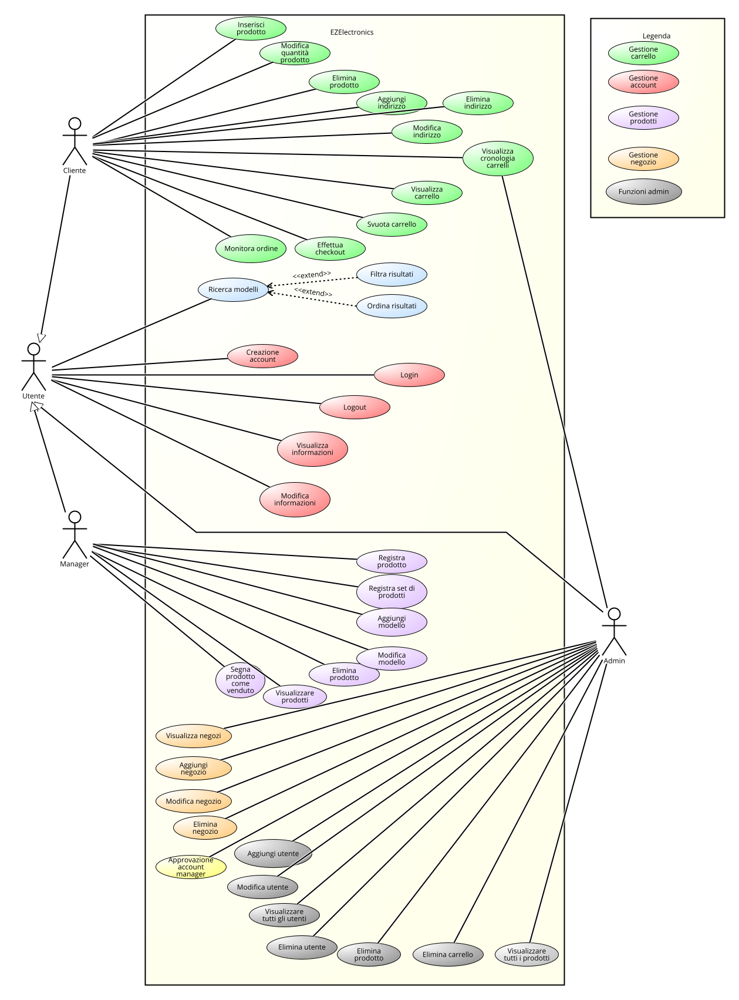
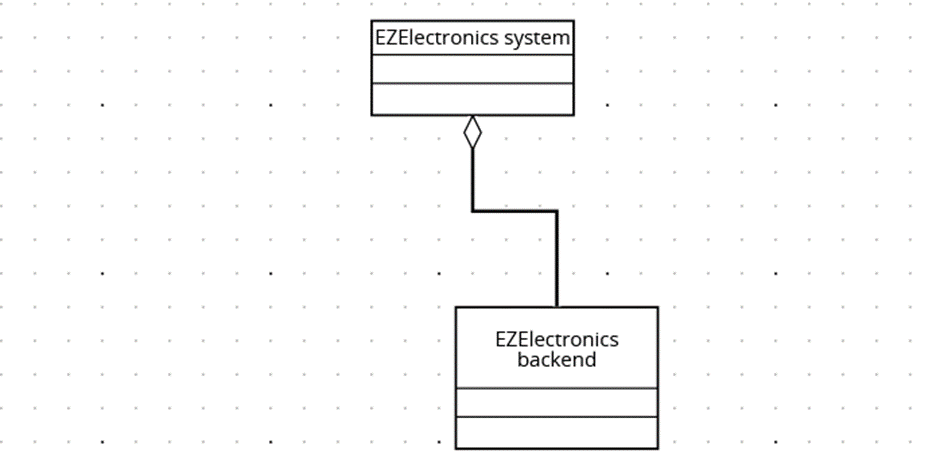

# Requirements Document - current EZElectronics

Date:

Version: V2 - description of EZElectronics 

| Version number |                       Change                        |
| :------------: | :-------------------------------------------------: |
|      1.0       |                  Versione iniziale                  |
| 1.1 | Aggiunti nuovi stakeholders|

# Contents

- [Requirements Document - current EZElectronics](#requirements-document---current-ezelectronics)
- [Contents](#contents)
- [Informal description](#informal-description)
- [Stakeholders](#stakeholders)
- [Context Diagram and interfaces](#context-diagram-and-interfaces)
  - [Context Diagram](#context-diagram)
  - [Interfaces](#interfaces)
- [Stories and personas](#stories-and-personas)
- [Functional and non functional requirements](#functional-and-non-functional-requirements)
  - [Functional Requirements](#functional-requirements)
  - [Table of rights](#table-of-rights)
  - [Non Functional Requirements](#non-functional-requirements)
- [Use case diagram and use cases](#use-case-diagram-and-use-cases)
    - [Use case diagram](#use-case-diagram)
  - [Use cases](#use-cases)
    - [UC1 - Creazione account Cliente](#uc1---creazione-account-cliente)
      - [Scenario 1.1](#scenario-11)
      - [Scenario 1.2](#scenario-12)
    - [UC2 - Creazione account Manager](#uc2---creazione-account-manager)
      - [Scenario 2.1](#scenario-21)
      - [Scenario 2.2](#scenario-22)
      - [Scenario 2.3](#scenario-23)
    - [UC3 - Login](#uc3---login)
      - [Scenario 3.1](#scenario-31)
      - [Scenario 3.2](#scenario-32)
    - [UC4 - Logout](#uc4---logout)
      - [Scenario 4.1](#scenario-41)
    - [UC5 - Visualizza informazioni profilo](#uc5---visualizza-informazioni-profilo)
      - [Scenario 5.1](#scenario-51)
    - [UC6 - Modifica informazioni profilo](#uc6---modifica-informazioni-profilo)
      - [Scenario 6.1](#scenario-61)
    - [UC7 - Aggiunta di un prodotto al carrello](#uc7---aggiunta-di-un-prodotto-al-carrello)
      - [Scenario 7.1](#scenario-71)
      - [Scenario 7.2](#scenario-72)
    - [UC8 - Rimozione di un prodotto dal carrello](#uc8---rimozione-di-un-prodotto-dal-carrello)
      - [Scenario 8.1](#scenario-81)
      - [Scenario 8.2](#scenario-82)
    - [UC9 - Modifica quantità di un prodotto nel carrello](#uc9---modifica-quantità-di-un-prodotto-nel-carrello)
      - [Scenario 9.1](#scenario-91)
      - [Scenario 9.2](#scenario-92)
    - [UC10 - Visualizzazione del carrello](#uc10---visualizzazione-del-carrello)
      - [Scenario 10.1](#scenario-101)
    - [UC11 - Svuotamento del carrello](#uc11---svuotamento-del-carrello)
      - [Scenario 11.1](#scenario-111)
    - [UC12 - Checkout del carrello](#uc12---checkout-del-carrello)
      - [Scenario 12.1](#scenario-121)
      - [Scenario 12.2](#scenario-122)
    - [UC13 - Aggiungi indirizzo di spedizione](#uc13---aggiungi-indirizzo-di-spedizione)
      - [Scenario 13.1](#scenario-131)
    - [UC14 - Modifica indirizzo di spedizione](#uc14---modifica-indirizzo-di-spedizione)
      - [Scenario 14.1](#scenario-141)
    - [UC15 - Rimozione indirizzo di spedizione](#uc15---rimozione-indirizzo-di-spedizione)
      - [Scenario 15.1](#scenario-151)
    - [UC16 - Visualizzazione ordini passati](#uc16---visualizzazione-ordini-passati)
      - [Scenario 16.1](#scenario-161)
    - [UC17 - Monitoraggio ordine](#uc17---monitoraggio-ordine)
      - [Scenario 17.1](#scenario-171)
      - [Scenario 17.2](#scenario-172)
    - [UC18 -  Ricerca prodotti](#uc18----ricerca-prodotti)
      - [Scenario 18.1](#scenario-181)
      - [Scenario 18.2](#scenario-182)
      - [Scenario 18.3](#scenario-183)
      - [Scenario 18.4](#scenario-184)
      - [Scenario 18.5](#scenario-185)
    - [UC19 - Filtraggio prodotti](#uc19---filtraggio-prodotti)
      - [Scenario 19.1](#scenario-191)
      - [Scenario 19.2](#scenario-192)
      - [Scenario 19.3](#scenario-193)
    - [UC20 - Ordinamento prodotti](#uc20---ordinamento-prodotti)
    - [UC21 - Aggiungi modello](#uc21---aggiungi-modello)
      - [Scenario 21.1](#scenario-211)
    - [UC22 - Modifica modello](#uc22---modifica-modello)
      - [Scenario 22.1](#scenario-221)
      - [Scenario 22.2](#scenario-222)
    - [UC23 - Registra prodotto](#uc23---registra-prodotto)
      - [Scenario 23.1](#scenario-231)
      - [Scenario 23.2](#scenario-232)
    - [UC24 - Registra set di prodotti](#uc24---registra-set-di-prodotti)
      - [Scenario 24.1](#scenario-241)
      - [Scenario 24.2](#scenario-242)
    - [UC25 - Eliminazione di un prodotto](#uc25---eliminazione-di-un-prodotto)
      - [Scenario 25.1](#scenario-251)
      - [Scenario 25.2](#scenario-252)
    - [UC26 - Segnalazione prodotto come venduto](#uc26---segnalazione-prodotto-come-venduto)
      - [Scenario 26.1](#scenario-261)
      - [Scenario 26.2](#scenario-262)
      - [Scenario 26.3](#scenario-263)
    - [UC27 - Aggiungi negozio](#uc27---aggiungi-negozio)
      - [Scenario 27.1](#scenario-271)
    - [UC28 - Modifica negozio](#uc28---modifica-negozio)
      - [Scenario 28.1](#scenario-281)
      - [Scenario 28.2](#scenario-282)
    - [UC29 - Eliminazione di un negozio](#uc29---eliminazione-di-un-negozio)
      - [Scenario 29.1](#scenario-291)
      - [Scenario 29.2](#scenario-292)
    - [U30 - Approvazione di un Manager](#u30---approvazione-di-un-manager)
      - [Scenario 30.1](#scenario-301)
      - [Scenario 30.2](#scenario-302)
    - [UC31 - Aggiunta di un utente](#uc31---aggiunta-di-un-utente)
      - [Scenario 31.1](#scenario-311)
      - [Scenario 31.2](#scenario-312)
    - [UC32 - Modifica di un utente](#uc32---modifica-di-un-utente)
      - [Scenario 32.1](#scenario-321)
      - [Scenario 32.2](#scenario-322)
    - [UC33 - Eliminazione di un utente](#uc33---eliminazione-di-un-utente)
      - [Scenario 33.1](#scenario-331)
      - [Scenario 33.2](#scenario-332)
    - [UC34 - Eliminazione di un prodotto](#uc34---eliminazione-di-un-prodotto)
      - [Scenario 34.1](#scenario-341)
      - [Scenario 34.2](#scenario-342)
    - [UC35 - Eliminazione di un carrello/ordine](#uc35---eliminazione-di-un-carrelloordine)
      - [Scenario 35.1](#scenario-351)
      - [Scenario 35.2](#scenario-352)
- [Glossary](#glossary)
- [System Design](#system-design)
- [Deployment Diagram](#deployment-diagram)

# Informal description

EZElectronics (read EaSy Electronics) is a software application designed to help managers of electronics stores to manage their products and offer them to customers through a dedicated website. Managers can assess the available products, record new ones, and confirm purchases. Customers can see available products, add them to a cart and see the history of their past purchases.

# Stakeholders

| Stakeholder            | Description                                                                                                                                                 |
|:------------------------:|:-------------------------------------------------------------------------------------------------------------------------------------------------------------:|
| Cliente                | Utente finale che utilizza l'applicazione per acquistare prodotti elettronici attraverso il sito web dedicato.                                            |
| Proprietario negozio / Manager | Gestore del negozio di elettronica che utilizza l'applicazione per gestire i prodotti e le vendite del negozio.                                           |
| Fornitore servizio di database | Azienda che fornisce il servizio di database utilizzato dall'applicazione per memorizzare e gestire i dati dei prodotti, degli utenti e delle transazioni. |
| Fornitore servizio di hosting web | Azienda che fornisce il servizio di hosting su cui è ospitato il sito web dell'applicazione, garantendo la sua disponibilità e accessibilità online. |
| Fornitore servizio di pagamento | Azienda che fornisce il servizio di pagamento dell’applicazione, garantendo che sia possibile pagare direttamente dall’applicazione i prodotti acquistati. |
| Admin di sistema       | Utente con privilegi massimi che si occupa della manutenibilità dell’applicazione ed è inoltre colui incaricato di fornire gli account di tipo manager.   |
| Fornitore servizio spedizione | Azienda che fornisce il servizio di spedizione, consentendo ai clienti di ricevere i propri prodotti direttamente a casa.                                 |

# Context Diagram and interfaces

## Context Diagram

## Interfaces

| Actor               | Logical interface                     | Physical interface        |
|:----------------------:|:------------------------------------------:|:----------------------------:|
| Cliente     | GUI (desktop o mobile)                   | Smartphone / PC            |
| Manager              | GUI (desktop o mobile)                   | Smartphone / PC            |
| Fornitore del database | [Documentazione PostgreSQL](https://www.postgresql.org/docs/) | Internet                   |
| Fornitore del servizio di hosting | [Documentazione DigitalOcean](https://docs.digitalocean.com/) | Internet                   |
| Fornitore del servizio di pagamento | [Documentazione PayPal](https://developer.paypal.com/home)             | Internet                   |
| Fornitore del servizio di spedizione | [UPS](https://www.ups.com/)                            | Internet                   |
| Admin di sistema    | GUI (desktop o mobile)                   | Smartphone / PC            |

# Stories and personas

**Nome**: Marco
**Ruolo**: Manager del negozio
**Background**: Marco ha una vasta esperienza nel settore della vendita al dettaglio e ha appena assunto la gestione del negozio di elettronica. Desidera ottimizzare le operazioni del negozio e migliorare l'esperienza dei clienti.
Marco ha notato che il processo di gestione dei prodotti nel negozio è inefficiente e porta a errori nella tenuta dell'inventario. Decide di utilizzare EZElectronics per semplificare il processo di gestione dei prodotti e migliorare l'efficienza complessiva del negozio. Utilizzando EZElectronics, Marco può facilmente registrare nuovi prodotti nel sistema, tenere traccia delle quantità disponibili e monitorare le vendite in tempo reale.

**Nome**: Martina, 41 anni, sposata
**Ruolo**: Cliente Occasionale
**Background**: Martina non è particolarmente esperta di tecnologia ma cerca comunque prodotti affidabili e convenienti per il suo uso quotidiano. Si affida spesso ai consigli del personale del negozio quando acquista dispositivi elettronici.
Martina ha bisogno di acquistare un nuovo laptop per suo figlio, che inizia a frequentare la scuola media. Utilizzando EZElectronics, può esplorare i diversi laptop disponibili nel negozio e confrontare le loro caratteristiche e prezzi. Dopo aver trovato un laptop adatto alle esigenze di suo figlio, aggiunge il prodotto al carrello e procede al checkout. Durante il processo di acquisto, apprezza la chiarezza e la semplicità dell'interfaccia utente di EZElectronics, che le permette di completare l'acquisto senza problemi.

# Functional and non functional requirements

## Functional Requirements

| **ID**   | **Description**                                                              |
| :----: | :------------------------------------------------------------------------:|
| **FR1**  | Gestione del carrello                                                    |
| FR1.1 | Un Cliente deve poter aggiungere un prodotto al carrello                |
| FR1.2 | Un Cliente deve poter aggiungere più prodotti dello stesso modello al carrello |
| FR1.3 | Un Cliente deve poter eliminare un prodotto nel carrello                 |
| FR1.4 | Un Cliente deve poter visualizzare il proprio carrello                   |
| FR1.5 | Un Cliente deve poter svuotare il proprio carrello                       |
| FR1.6 | Un Cliente deve poter effettuare il check out del proprio carrello        |
| FR1.7 | Un Cliente deve poter visualizzare la cronologia dei carrelli già pagati in passato (ovvero gli acquisti precedenti) |
| **FR2**  | Gestione degli utenti                                                   |
| FR2.1 | Un utente deve essere in grado di creare un proprio account personale con il ruolo di Customer |
| FR2.2 | Un utente che vuole registrarsi come Manager deve poter mandare una richiesta di registrazione a un Admin, che la potrà approvare |
| FR2.3 | Un utente deve essere in grado di effettuare il login alla piattaforma    |
| FR2.4 | Un utente deve essere in grado di effettuare il logout dalla piattaforma   |
| FR2.5 | Un utente deve essere in grado di reperire le informazioni sul proprio account |
| FR2.6 | Un utente deve essere in grado di modificare le informazioni sul proprio account |
| **FR3**  | Gestione dei prodotti                                                    |
| FR3.1 | Un Manager deve essere in grado di registrare uno o più nuovi prodotti  |
| FR3.2 | Un Manager deve essere in grado di aggiungere e modificare i modelli     |
| FR3.3 | Un Manager deve essere in grado di cancellare uno o più prodotti esistenti |
| FR3.4 | Il Manager deve poter contrassegnare i prodotti come venduti              |
| **FR4**  | Visualizzazione dei prodotti                                             |
| FR4.1 | Un utente deve essere in grado di visualizzare la lista di tutti i prodotti |
| FR4.2 | Un utente deve essere in grado di visualizzare tutti i prodotti appartenenti ad una specifica categoria |
| FR4.3 | Un utente deve essere in grado di visualizzare tutti i modelli venduti dai diversi negozi |
| FR4.4 | Un utente deve essere in grado di filtrare i prodotti che sono stati venduti da quelli disponibili |
| FR4.5 | Un utente deve essere in grado di ordinare i prodotti nella pagina secondo prezzo crescente o decrescente |
| FR4.6 | Un utente deve essere in grado di filtrare i prodotti attraverso l’inserimento di un range di prezzo |
| **FR5**  | Gestione pagamento                                                       |
| FR5.1 | Un cliente deve poter richiedere il pagamento del proprio carrello       |
| FR5.2 | Il cliente deve essere informato dell’avvenuto pagamento del suo carrello |
| **FR6**  | Gestione spedizione prodotti                                             |
| FR6.1 | Un cliente deve poter selezionare un metodo di spedizione fra quelli proposti |
| FR6.2 | Un cliente deve essere in grado di memorizzare nuovi indirizzi, modificare o eliminare quelli esistenti |
| FR6.3 | Il cliente deve poter visualizzare il prezzo finale compreso di costo prodotti e costi di spedizione |
| FR6.4 | Il cliente deve poter monitorare lo stato dell'ordine |
| **FR7**  | Funzioni amministratore                                                  |
| FR7.1 | Un Admin deve essere in grado di registrare, modificare ed eliminare un negozio |
| FR7.2 | Un Admin deve essere in grado di approvare le registrazioni dei manager dei negozi |
| FR7.3 | Un Admin deve essere in grado di visualizzare, aggiungere, modificare ed eliminare tutti gli utenti (testing) |
| FR7.4 | Un Admin deve essere in grado di visualizzare, aggiungere, modificare ed eliminare tutti i prodotti (testing) |
| FR7.5 | Un Admin deve essere in grado di visualizzare, modificare ed eliminare tutti i carrelli degli utenti (testing) |

## Table of rights

|   ID    | Cliente | Manager | Admin |
| :-----: | :-----: | :-----: | :---: |
| **FR1** |    X    |         |       |
|  FR1.1  |    X    |         |       |
|  FR1.2  |    X    |         |       |
|  FR1.3  |    X    |         |       |
|  FR1.4  |    X    |         |       |
|  FR1.5  |    X    |         |       |
|  FR1.6  |    X    |         |       |
|  FR1.7  |    X    |         |       |
| **FR2** |   X    |     X   |   X   |
|  FR2.1  |    X    |        |       |
|  FR2.2  |        |    X    |      |
|  FR2.3  |    X    |    X    |  X     |
|  FR2.4  |    X    |    X    |  X     |
|  FR2.5  |    X    |    X    |    X   |
|  FR2.6  |    X    |    X    |    X   |
| **FR3** |         |    X    |      |
|  FR3.1  |         |    X    |       |
|  FR3.2  |         |    X    |       |
|  FR3.3  |         |    X    |       |
|  FR3.4  |         |    X    |       |
| **FR4** |    X    |    X    |  X     |
|  FR4.1  |    X    |    X    |   X    |
|  FR4.2  |    X    |    X    |    X   |
|  FR4.3  |    X    |    X    |     X  |
|  FR4.4  |    X    |    X    |     X  |
|  FR4.5  |    X    |    X    |     X  |
|  FR4.6  |    X    |    X    |   X    |
|  **FR5**  |    X    |        |       |
|  FR5.1  |    X    |        |       |
|  FR5.2  |    X    |        |       |
|  **FR6**  |    X    |        |       |
|  FR6.1  |    X    |        |       |
|  FR6.2  |    X    |        |       |
|  FR6.3  |    X    |        |       |
|  FR6.4  |    X    |        |       |
|  **FR7**  |        |        | X      |
|  FR7.1  |        |        |   X    |
|  FR7.2  |        |        |   X    |
|  FR7.3  |        |        |   X    |
|  FR7.4  |        |        |   X    |
|  FR7.5  |        |        |   X    |

## Non Functional Requirements

| ID   | Tipo        | Descrizione                                                                                                                                                  | Si riferisce a        |
|:------:|:-------------:|:--------------------------------------------------------------------------------------------------------------------------------------------------------------:|:-----------------------:|
| NFR1 | Portabilità | Il sito web deve funzionare correttamente almeno sulle ultime due versioni dei principali browser (Safari, Chrome, Firefox, Opera, Brave)                  | Tutti i FR            |
| NFR2 | Portabilità | L'applicazione deve essere sviluppata utilizzando tecnologie e framework cross-platform per garantire la sua esecuzione su diverse piattaforme             | Tutti i FR            |
| NFR3 | Usabilità   | L'interfaccia grafica (GUI) deve essere intuitiva ed usabile dagli utenti senza bisogno di training specifico                                                  | Tutti i FR            |
| NFR4 | Usabilità   | Il sito web dedicato deve essere progettato con un layout responsive che si adatti automaticamente a diverse dimensioni di schermo, garantendo un'esperienza utente ottimale su dispositivi desktop, tablet e smartphone. | Tutti i FR |
| NFR5 | Efficienza  | Il caricamento delle pagine deve richiedere meno di 200ms (escluso la connessione di rete)                                                                    | Tutti i FR            |
| NFR6 | Efficienza  | L'applicazione deve essere in grado di gestire un elevato numero di transazioni simultanee senza compromettere le prestazioni (almeno 5000)                      | Tutti i FR            |
| NFR7 | Affidabilità| Il sito web deve mantenere memorizzate le informazioni (es: stato del carrello)                                                                              | FR1.3                 |
| NFR8 | Affidabilità| L'applicazione deve essere progettata per essere resistente ai guasti e per garantire la disponibilità continua del servizio, con un obiettivo di uptime del 99%. | Tutti i FR            |
| NFR9 | Sicurezza   | Tutte le comunicazioni tra l'applicazione e i server devono essere crittografate utilizzando protocolli sicuri come HTTPS per proteggere i dati degli utenti durante la trasmissione | Tutti i FR |
| NFR10| Manutenibilità | L'applicazione dovrebbe avere il minor numero di bug possibile in modo che gli utenti non segnalino più di tre problemi all'anno                              | Tutti i FR            |
| NFR11| Sicurezza   | Il servizio di pagamenti deve utilizzare protocolli sicuri come HTTPS/TLS per proteggere i dati sensibili degli utenti.                     | FR5                   |

# Use case diagram and use cases

### Use case diagram

## Use cases

### UC1 - Creazione account Cliente

| **Actors Involved** | **Cliente**      |
| ------------------- | ------------------------- |
| Precondition        | L’utente non è registrato |
| Post condition      | L’utente è registrato     |
| Nominal Scenario    | Scenario 1.1              |
| Variants            | Nessuna                   |
| Exceptions          | Scenario 1.2              |

#### Scenario 1.1

| **Scenario 1.1** | **Registrazione**                                                            |
| ---------------- | ---------------------------------------------------------------------------- |
| Precondition     | L’utente non è registrato                                                    |
| Post condition   | L'utente è registrato                                                        |
| Step#            | Description                                                                  |
| 1                | L’utente chiede di registrarsi come cliente                                           |
| 2                | Il sistema chiede nome, cognome, username, email e password                   |
| 3                | L’utente inserisce i dati richiesti                                          |
| 4                | Il sistema acquisisce i dati inseriti                                        |
| 5                | Il sistema controlla che l’username non sia associato a un account esistente |
| 6                | Il sistema salva i dati e registra l’utente                                  |

#### Scenario 1.2

| **Scenario 1.2** | **Username già registrato**                                                    |
| ---------------- | ------------------------------------------------------------------------------ |
| Precondition     | L’utente non è registrato, l'username inserito è gia registrato nel sistema    |
| Post condition   | L'utente non è registrato                                                      |
| Step#            | Description                                                                    |
| 1                | L’utente chiede di registrarsi come cliente                                                |
| 2                | Il sistema chiede nome, cognome, username, email e password                 |
| 3                | L’utente inserisce i dati richiesti                                            |
| 4                | Il sistema acquisisce i dati inseriti                                          |
| 5                | Il sistema controlla che l’username non sia associato a un account esistente   |
| 6                | Il nome utente è già associato a un account e il sistema restituisce un errore |

### UC2 - Creazione account Manager

| **Actors Involved** | **Manager**      |
| ------------------- | ------------------------- |
| Precondition        | L’utente non è registrato |
| Post condition      | L’utente è registrato     |
| Nominal Scenario    | Scenario 2.1            |
| Variants            | Nessuna                   |
| Exceptions          | Scenario 2.2, 2.3              |

#### Scenario 2.1

| **Scenario 2.1** | **Registrazione**                                                            |
| ---------------- | ---------------------------------------------------------------------------- |
| Precondition     | L’utente non è registrato                                                    |
| Post condition   | L'utente è registrato                                                        |
| Step#            | Description                                                                  |
| 1                | L’utente chiede di registrarsi come manager                                          |
| 2                | Il sistema chiede nome, cognome, username, email, password e negozio                   |
| 3                | L’utente inserisce i dati richiesti                                          |
| 4                | Il sistema acquisisce i dati inseriti                                        |
| 5                | Il sistema controlla che l’username non sia associato a un account esistente |
| 6                | Il sistema salva i dati e registra l’account manager                                |
| 7                | Il sistema invia una richiesta di registrazione all'Admin per l'approvazione del manager |
| 8                | L'Admin approva la richiesta di registrazione del manager |
| 9                | Il sistema notifica il manager dell'avvenuta registrazione |

#### Scenario 2.2

| **Scenario 2.2** | **Username già registrato**                                                    |
| ---------------- | ------------------------------------------------------------------------------ |
| Precondition     | L’utente non è registrato, l'username inserito è gia registrato nel sistema    |
| Post condition   | L'utente non è registrato                                                      |
| Step#            | Description                                                                    |
| 1                | L’utente chiede di registrarsi come manager                                                |
| 2                | Il sistema chiede nome, cognome, username, email, password e negozio         |
| 3                | L’utente inserisce i dati richiesti                                            |
| 4                | Il sistema acquisisce i dati inseriti                                          |
| 5                | Il sistema controlla che l’username non sia associato a un account esistente   |
| 6                | Il nome utente è già associato a un account e il sistema restituisce un errore |

#### Scenario 2.3

| **Scenario 2.3** | **Richiesta di registrazione non approvata**                                   |
| ---------------- | ------------------------------------------------------------------------------ |
| Precondition     | L’utente ha richiesto la registrazione come manager, ma la richiesta non è stata approvata |
| Post condition   | L'utente non è registrato                                                      |
| Step#            | Description                                                                    |
| 1                | L’utente chiede di registrarsi come manager                                                |
| 2                | Il sistema chiede nome, cognome, username, email, password e negozio         |
| 3                | L’utente inserisce i dati richiesti                                            |
| 4                | Il sistema acquisisce i dati inseriti                                          |
| 5                | Il sistema controlla che l’username non sia associato a un account esistente   |
| 6                | Il sistema invia una richiesta di registrazione all'Admin per l'approvazione del manager |
| 7                | L'Admin rifiuta la richiesta di registrazione del manager |
| 8                | Il sistema notifica il manager dell'avvenuto rifiuto della registrazione |

### UC3 - Login

| **Actors Involved** | **Cliente, Manager, Admin**                |
| ------------------- | ----------------------------------- |
| Precondition        | L’utente è registrato e non loggato |
| Post condition      | L’utente è loggato                  |
| Nominal Scenario    | Scenario 3.1                        |
| Variants            | Nessuna                             |
| Exceptions          | Scenario 3.2                  |

#### Scenario 3.1

| **Scenario 3.1** | **Utente loggato con successo**                                                                    |
| ---------------- | -------------------------------------------------------------------------------------------------- |
| Precondition     | L’utente è registrato e non loggato                                                                |
| Post condition   | L’utente è loggato                                                                                 |
| Step#            | Description                                                                                        |
| 1                | L’utente chiede di loggarsi                                                                        |
| 2                | Il sistema chiede nome utente e password                                                           |
| 3                | L’utente inserisce nome utente e password                                                          |
| 4                | Il sistema acquisisce i dati inseriti                                                              |
| 5                | Il sistema controlla che l’username sia associato a un account esistente e la password corrisponda |
| 6                | Il sistema autentica l’utente                                                                      |

#### Scenario 3.2

| **Scenario 3.2** | **Credenziali errate**                                                                             |
| ---------------- | -------------------------------------------------------------------------------------------------- |
| Precondition     | L’utente è registrato e non loggato                                                                |
| Post condition   | L’utente non è loggato                                                                             |
| Step#            | Description                                                                                        |
| 1                | L’utente chiede di loggarsi                                                                        |
| 2                | Il sistema chiede nome utente e password                                                           |
| 3                | L’utente inserisce nome utente e password                                                          |
| 4                | Il sistema acquisisce i dati inseriti                                                              |
| 5                | Il sistema controlla che l’username sia associato a un account esistente e la password corrisponda |
| 6                | Il sistema vede che le credenziali sono errate e restituisce errore                                |

### UC4 - Logout

| **Actors Involved** | **Cliente, Manager, Admin**   |
| ------------------- | ---------------------- |
| Precondition        | L’utente è loggato     |
| Postcondition       | L’utente non è loggato |
| Nominal Scenario    | Scenario 4.1           |
| Variants            | Nessuna                |
| Exceptions          | Nessuna                |

#### Scenario 4.1

| **Scenario 4.1** | **Utente disconnesso con successo**                                      |
| ---------------- | ------------------------------------------------------------------------ |
| Precondition     | L’utente è loggato                                                       |
| Post condition   | L’utente non è loggato                                                   |
| Step#            | Description                                                              |
| 1                | L’utente chiede di eseguire il logout                                    |
| 2                | Il sistema verifica che l’utente sia loggato                             |
| 3                | Il sistema esegue il logout dell'utente, invalidando la sessione attuale |
| 4                | Il sistema mostra un messaggio di conferma di avvenuta disconnessione    |

### UC5 - Visualizza informazioni profilo

| **Actors Involved** | **Cliente, Manager, Admin**                                |
| ------------------- | --------------------------------------------------- |
| Precondition        | L’utente è loggato                                  |
| Postcondition       | L’utente visualizza le informazioni sul suo profilo |
| Nominal Scenario    | Scenario 5.1                                        |
| Variants            | Nessuna                                             |
| Exceptions          | Nessuna                                             |

#### Scenario 5.1

| **Scenario 5.1** | **Utente visualizza informazioni profilo**                       |
| ---------------- | ---------------------------------------------------------------- |
| Precondition     | L’utente è loggato                                               |
| Post condition   | L’utente visualizza le informazioni sul suo profilo              |
| Step#            | Description                                                      |
| 1                | L’utente richiede al sistema le informazioni sul proprio profilo |
| 2                | Il sistema verifica che l’utente sia loggato                     |
| 3                | Il sistema restituisce le informazioni sul profilo dell'utente   |

### UC6 - Modifica informazioni profilo

| **Actors Involved** | **Cliente, Manager, Admin**                                |
| ------------------- | --------------------------------------------------- |
| Precondition        | L’utente è loggato                                  |
| Postcondition       | L’utente modifica le informazioni sul suo profilo |
| Nominal Scenario    | Scenario 6.1                                        |
| Variants            | Nessuna                                             |
| Exceptions          | Nessuna                                             |

#### Scenario 6.1

| **Scenario 6.1** | **Utente modifica informazioni profilo**                       |
| ---------------- | ---------------------------------------------------------------- |
| Precondition     | L’utente è loggato                                               |
| Post condition   | L’utente modifica le informazioni sul suo profilo              |
| Step#            | Description                                                      |
| 1                | L’utente chiede al sistema di modificare le informazioni sul proprio profilo |
| 2                | Il sistema verifica che l’utente sia loggato                     |
| 3                | Il sistema permette all'utente di modificare le informazioni sul proprio profilo, ovvero email, nome, cognome e password |
| 4                | Il sistema salva le modifiche apportate dall'utente |

### UC7 - Aggiunta di un prodotto al carrello

| **Actors Involved** | **Cliente**                                        |
| ------------------- | -------------------------------------------------- |
| Precondition        | Il cliente è loggato                               |
| Postcondition       | Un prodotto viene aggiunto al carrello del cliente |
| Nominal Scenario    | Scenario 7.1                                       |
| Variants            | Nessuna                                            |
| Exceptions          | Scenario 7.2                                       |

#### Scenario 7.1

| **Scenario 7.1** | **Prodotto aggiunto con successo**                      |
| ---------------- | ------------------------------------------------------- |
| Precondition     | Il cliente è loggato                                    |
| Post condition   | Un prodotto viene aggiunto al carrello del cliente      |
| Step#            | Description                                             |
| 1                | Il cliente chiede di aggiungere un prodotto al carrello |
| 2                | Il sistema verifica che il cliente sia loggato          |
| 3                | Il sistema verifica che il prodotto sia disponibile     |
| 4                | Il sistema aggiunge il prodotto al carrello del cliente |

#### Scenario 7.2

| **Scenario 7.2** | **Prodotto non disponibile**                                                              |
| ---------------- | ----------------------------------------------------------------------------------------- |
| Precondition     | Il cliente è loggato                                                                      |
| Post condition   | Il prodotto non viene aggiunto al carrello                                                |
| Step#            | Description                                                                               |
| 1                | Il cliente chiede di aggiungere un prodotto al carrello                                   |
| 2                | Il sistema verifica che il cliente sia loggato                                            |
| 3                | Il sistema verifica che il prodotto sia disponibile                                       |
| 4                | Il sistema riconosce che il prodotto non è disponibile e visualizza un messaggio d’errore |

### UC8 - Rimozione di un prodotto dal carrello

| **Actors Involved** | **Cliente**                                      |
| ------------------- | ------------------------------------------------ |
| Precondition        | Il cliente è loggato                             |
| Postcondition       | Il prodotto X è rimosso dal carrello del cliente |
| Nominal Scenario    | Scenario 8.1                                     |
| Variants            | Nessuna                                          |
| Exceptions          | Scenario 8.2                                     |

#### Scenario 8.1

| **Scenario 8.1** | **Prodotto rimosso con successo**                                                                |
| ---------------- | ------------------------------------------------------------------------------------------------ |
| Precondition     | Il cliente è loggato                                                                             |
| Post condition   | Il prodotto X è rimosso dal carrello del cliente                                                 |
| Step#            | Description                                                                                      |
| 1                | Il cliente chiede di rimuovere un prodotto X dal carrello                                        |
| 2                | Il sistema verifica che il cliente sia loggato e che il prodotto X sia presente nel suo carrello |
| 3                | Il sistema rimuove il prodotto X dal carrello del cliente                                        |

#### Scenario 8.2

| **Scenario 8.2** | **Prodotto non presente nel carrello**                                                           |
| ---------------- | ------------------------------------------------------------------------------------------------ |
| Precondition     | Il cliente è loggato                                                                             |
| Post condition   | Il prodotto non è rimosso dal carrello del cliente                                               |
| Step#            | Description                                                                                      |
| 1                | Il cliente chiede di rimuovere un prodotto al carrello                                           |
| 2                | Il sistema verifica che il cliente sia loggato e che il prodotto X sia presente nel suo carrello |
| 3                | Il sistema riconosce che il prodotto non si trova nel carrello e mostra un messaggio d’errore    |

### UC9 - Modifica quantità di un prodotto nel carrello

| **Actors Involved** | **Cliente**                               |
| ------------------- | ----------------------------------------- |
| Precondition        | Il cliente è loggato e possiede un prodotto nel carrello                     |
| Postcondition       | La quantità di un prodotto nel carrello viene modificata  |
| Nominal Scenario    | Scenario 9.1                              |
| Variants            | Nessuna                                   |
| Exceptions          | Scenario 9.2                                   |

#### Scenario 9.1

| **Scenario 9.1** | **Quantità modificata con successo**                               |
| ---------------- | -------------------------------------------------------------------- |
| Precondition     | Il cliente è loggato                                                 |
| Postcondition |    La quantità del prodotto nel carrello viene modificata       |
|Step#|Description|
|1|Il cliente chiede di visualizzare il carrello|
|2|Il sistema verifica che l'utente sia loggato e il cliente è rimandato alla pagina del carrello|
|3|Il cliente richiede di modificare la quantità del prodotto |
|4|Il sistema verifica che la quantità desiderata sia disponibile|
|5| Il sistema modifica la quattità del prodotto |

#### Scenario 9.2

| **Scenario 9.2** | **Quantità richiesta non disponibile**                               |
| ---------------- | -------------------------------------------------------------------- |
| Precondition     | Il cliente è loggato             |
| Postcondition |    La quantità del prodotto nel carrello non viene modificata       |
|Step#|Description|
|1|Il cliente chiede di visualizzare il carrello|
|2|Il sistema verifica che l'utente sia loggato e il cliente è rimandato alla pagina del carrello|
|3|Il cliente richiede di modificare la quantità del prodotto |
|4|Il sistema verifica che la quantità desiderata sia disponibile|
|5| Il sistema rileva che la quantità richiesta non è disponibile e non permette al cliente di modificarla

### UC10 - Visualizzazione del carrello

| **Actors Involved** | **Cliente**                               |
| ------------------- | ----------------------------------------- |
| Precondition        | Il cliente è loggato                      |
| Postcondition       | La pagina del carrello viene visualizzata |
| Nominal Scenario    | Scenario 10.1                              |
| Variants            | Nessuna                                   |
| Exceptions          | Nessuna                                   |

#### Scenario 10.1

| **Scenario 10.1** | **Carrello visualizzato con successo**                               |
| ---------------- | -------------------------------------------------------------------- |
| Precondition     | Il cliente è loggato                                                 |
| Post condition   | La pagina del carrello viene visualizzata                            |
| Step#            | Description                                                          |
| 1                | Il cliente chiede di visualizzare il carrello                        |
| 2                | Il sistema verifica che il cliente sia loggato                       |
| 3                | Il sistema restituisce i prodotti contenuti nel carrello del cliente |

### UC11 - Svuotamento del carrello

| **Actors Involved** | **Cliente**                                               |
| ------------------- | --------------------------------------------------------- |
| Precondition        | Il cliente è loggato                                      |
| Postcondition       | Tutti i prodotti all'interno del carrello vengono rimossi |
| Nominal Scenario    | Scenario 11.1                                              |
| Variants            | Nessuna                                                   |
| Exceptions          | Nessuna                                                   |

#### Scenario 11.1

| **Scenario 11.1** | **Carrello svuotato**                                                 |
| ---------------- | --------------------------------------------------------------------- |
| Precondition     | Il cliente è loggato                                                  |
| Post condition   | Tutti i prodotti all'interno del carrello vengono rimossi             |
| Step#            | Description                                                           |
| 1                | Il cliente chiede di svuotare il carrello                             |
| 2                | Il sistema verifica che il cliente sia loggato                        |
| 3                | Il sistema rimuove tutti i prodotti presenti nel carrello del cliente |

### UC12 - Checkout del carrello

| **Actors Involved** | **Cliente**                                               |
| ------------------- | --------------------------------------------------------- |
| Precondition        | Il cliente è loggato                                      |
| Postcondition       | Il cliente effettua il pagamento del carrello             |
| Nominal Scenario    | Scenario 12.1                                              |
| Variants            | Nessuna                                                   |
| Exceptions          | 12.2                                                   |

#### Scenario 12.1

| **Scenario 12.1** | **Pagamento effettuato con successo**                               |
| ---------------- | ------------------------------------------------------------------ |
| Precondition     | Il cliente è loggato                                               |
| Post condition   | Il cliente effettua il pagamento del carrello                      |
| Step#            | Description                                                        |
| 1                | Il cliente chiede di effettuare il pagamento del carrello          |
| 2                | Il sistema verifica che il cliente sia loggato                     |
| 3                | Il sistema verifica che il carrello non sia vuoto e che i prodotti siano disponibili                |
| 4 | Il sistema verifica che il cliente abbia selezionato un metodo di spedizione |
| 5 | Il sistema verifica che il cliente abbia selezionato un indirizzo di spedizione |
| 6 | Il sistema reindirizza il cliente alla pagina di pagamento |
| 7 | Il cliente effettua il pagamento |
| 8 | Il sistema mostra un messaggio di conferma del pagamento |

#### Scenario 12.2

| **Scenario 12.2** | **Carrello vuoto o prodotti non disponibili**                                                  |
| ---------------- | ------------------------------------------------------------------ |
| Precondition     | Il cliente è loggato                                               |
| Post condition   | Il cliente non effettua il pagamento del carrello                 |
| Step#            | Description                                                        |
| 1                | Il cliente chiede di effettuare il pagamento del carrello          |
| 2                | Il sistema verifica che il cliente sia loggato                     |
| 3                | Il sistema verifica che il carrello non sia vuoto e che i prodotti siano disponibili                |
| 4 | Il sistema rileva che il carrello è vuoto o che i prodotti non sono disponibili |
| 5 | Il sistema restituisce un messaggio di errore |

### UC13 - Aggiungi indirizzo di spedizione

| **Actors Involved** | **Cliente**                                               |
| ------------------- | --------------------------------------------------------- |
| Precondition        | Il cliente è loggato                                      |
| Postcondition       | L'indirizzo di spedizione viene aggiunto al profilo del cliente |
| Nominal Scenario    | Scenario 13.1                                              |
| Variants            | Nessuna                                                   |
| Exceptions          | Nessuna                                                   |

#### Scenario 13.1

| **Scenario 13.1** | **Indirizzo aggiunto con successo**                               |
| ---------------- | ---------------------------------------------------------------- |
| Precondition     | Il cliente è loggato                                             |
| Post condition   | L'indirizzo di spedizione viene aggiunto al profilo del cliente  |
| Step#            | Description                                                      |
| 1                | Il cliente chiede di aggiungere un indirizzo di spedizione al proprio profilo |
| 2                | Il sistema verifica che il cliente sia loggato                   |
| 3                | Il sistema chiede i dati relativi all'indirizzo di spedizione     |
| 4                | Il cliente inserisce i dati richiesti                            |
| 5                | Il sistema salva l'indirizzo di spedizione nel profilo del cliente |

### UC14 - Modifica indirizzo di spedizione

| **Actors Involved** | **Cliente**                                               |
| ------------------- | --------------------------------------------------------- |
| Precondition        | Il cliente è loggato e ha almeno un indirizzo di spedizione registrato |
| Postcondition       | L'indirizzo di spedizione viene modificato |
| Nominal Scenario    | Scenario 14.1                                              |
| Variants            | Nessuna                                                   |
| Exceptions          | Nessuna                                                   |

#### Scenario 14.1

| **Scenario 14.1** | **Indirizzo modificato con successo**                               |
| ---------------- | ---------------------------------------------------------------- |
| Precondition     | Il cliente è loggato e ha almeno un indirizzo di spedizione registrato |
| Post condition   | L'indirizzo di spedizione viene modificato |
| Step#            | Description                                                      |
| 1                | Il cliente chiede di modificare un indirizzo di spedizione al proprio profilo |
| 2                | Il sistema verifica che il cliente sia loggato                   |
| 3                | Il sistema permette al cliente di modificare l'indirizzo di spedizione  |
| 4                | Il cliente inserisce i dati richiesti                            |

### UC15 - Rimozione indirizzo di spedizione

| **Actors Involved** | **Cliente**                                               |
| ------------------- | --------------------------------------------------------- |
| Precondition        | Il cliente è loggato e ha almeno un indirizzo di spedizione registrato |
| Postcondition       | L'indirizzo di spedizione viene rimosso |
| Nominal Scenario    | Scenario 15.1                                              |
| Variants            | Nessuna                                                   |
| Exceptions          | Nessuna                                                   |

#### Scenario 15.1

| **Scenario 15.1** | **Indirizzo rimosso con successo**                               |
| ---------------- | ---------------------------------------------------------------- |
| Precondition     | Il cliente è loggato e ha almeno un indirizzo di spedizione registrato |
| Post condition   | L'indirizzo di spedizione viene rimosso |
| Step#            | Description                                                      |
| 1                | Il cliente chiede di rimuovere un indirizzo di spedizione dal proprio profilo |
| 2                | Il sistema verifica che il cliente sia loggato                   |
| 3                | Il sistema permette al cliente di rimuovere l'indirizzo di spedizione  |
| 4                | Il cliente seleziona l'indirizzo da rimuovere                            |

### UC16 - Visualizzazione ordini passati

| **Actors Involved** | **Cliente**                                               |
| ------------------- | --------------------------------------------------------- |
| Precondition        | Il cliente è loggato                                      |
| Postcondition       | Il cliente visualizza la lista degli ordini passati |
| Nominal Scenario    | Scenario 16.1                                              |
| Variants            | Nessuna                                                   |
| Exceptions          | Nessuna                                                   |

#### Scenario 16.1

| **Scenario 16.1** | **Ordini visualizzati con successo**                               |
| ---------------- | ---------------------------------------------------------------- |
| Precondition     | Il cliente è loggato                                             |
| Post condition   | Il cliente visualizza la lista degli ordini passati             |
| Step#            | Description                                                      |
| 1                | Il cliente chiede di visualizzare la lista degli ordini passati  |
| 2                | Il sistema verifica che il cliente sia loggato                   |
| 3                | Il sistema restituisce la lista degli ordini passati del cliente |

### UC17 - Monitoraggio ordine

| **Actors Involved** | **Cliente**                                               |
| ------------------- | --------------------------------------------------------- |
| Precondition        | Il cliente è loggato                                      |
| Postcondition       | Il cliente visualizza lo stato dell'ordine |
| Nominal Scenario    | Scenario 17.1                                              |
| Variants            | Nessuna                                                   |
| Exceptions          | 17.2                                                   |

#### Scenario 17.1

| **Scenario 17.1** | **Ordine monitorato con successo**                               |
| ---------------- | ---------------------------------------------------------------- |
| Precondition     | Il cliente è loggato                                             |
| Post condition   | Il cliente visualizza lo stato dell'ordine             |
| Step#            | Description                                                      |
| 1                | Il cliente chiede di monitorare lo stato di un ordine  |
| 2                | Il sistema verifica che il cliente sia loggato e che l'ordine esista                |
| 3                | Il sistema restituisce lo stato dell'ordine |

#### Scenario 17.2

| **Scenario 17.2** | **Ordine non esistente**                               |
| ---------------- | ---------------------------------------------------------------- |
| Precondition     | Il cliente è loggato                                             |
| Post condition   | Il cliente non visualizza lo stato dell'ordine             |
| Step#            | Description                                                      |
| 1                | Il cliente chiede di monitorare lo stato di un ordine  |
| 2                | Il sistema verifica che il cliente sia loggato e che l'ordine esista                |
| 3                | Il sistema rileva che l'ordine non esiste e restituisce un messaggio di errore |

### UC18 -  Ricerca prodotti

| **Actors Involved** | **Cliente, Manager, Admin**                                               |
| ------------------- | --------------------------------------------------------- |
| Precondition        | L'utente è loggato                                      |
| Postcondition       | Il sistema restituisce la lista dei prodotti |
| Nominal Scenario    | Scenario 18.1                                              |
| Variants            | 18.2, 18.3, 18.4                                                    |
| Exceptions          | 18.5                                                   |

#### Scenario 18.1

| **Scenario 18.1** | **Prodotti trovati con successo**                               |
| ---------------- | ---------------------------------------------------------------- |
| Precondition     | L'utente è loggato                                             |
| Post condition   | Il sistema restituisce la lista dei prodotti          |
| Step#            | Description                                                      |
| 1                | L'utente chiede di visualizzare la lista dei prodotti  |
| 2                | Il sistema verifica che l'utente sia loggato             |
| 3                | Il sistema restituisce la lista dei prodotti |

#### Scenario 18.2  

| **Scenario 18.2** | **Ricerca prodotto per categoria**                               |
| ---------------- | ---------------------------------------------------------------- |
| Precondition     | L'utente è loggato                                             |
| Post condition   | Il sistema restituisce la lista dei prodotti appartenenti ad una certa categoria          |
| Step#            | Description                                                      |
| 1                | L'utente chiede di visualizzare la lista dei prodotti di una certa categoria  |
| 2                | Il sistema verifica che l'utente sia loggato             |
| 3                | Il sistema restituisce la lista dei prodotti appartenenti ad una certa categoria |

#### Scenario 18.3

| **Scenario 18.3** | **Ricerca prodotto per modello**                               |
| ---------------- | ---------------------------------------------------------------- |
| Precondition     | L'utente è loggato                                             |
| Post condition   | Il sistema restituisce la lista dei prodotti con un certo modello          |
| Step#            | Description                                                      |
| 1                | L'utente chiede di visualizzare la lista dei prodotti con un certo modello  |
| 2                | Il sistema verifica che l'utente sia loggato             |
| 3                | Il sistema restituisce la lista dei prodotti con un certo modello |

#### Scenario 18.4

| **Scenario 18.4** | **Visualizzazione di un singolo prodotto**                               |
| ---------------- | ---------------------------------------------------------------- |
| Precondition     | L'utente è loggato                                             |
| Post condition   | Il sistema restituisce le informazioni di un singolo prodotto          |
| Step#            | Description                                                      |
| 1                | L'utente chiede di visualizzare le informazioni di un singolo prodotto  |
| 2                | Il sistema verifica che l'utente sia loggato e che il prodotto esista            |
| 3                | Il sistema restituisce le informazioni di un singolo prodotto |

#### Scenario 18.5

| **Scenario 18.5** | **Prodotto non trovato**                               |
| ---------------- | ---------------------------------------------------------------- |
| Precondition     | L'utente è loggato                                             |
| Post condition   | Il sistema restituisce un messaggio di errore          |
| Step#            | Description                                                      |
| 1                | L'utente chiede di visualizzare le informazioni di un prodotto  |
| 2                | Il sistema verifica che l'utente sia loggato e che il prodotto esista            |
| 3                | Il sistema rileva che il prodotto non esiste e restituisce un messaggio di errore |

### UC19 - Filtraggio prodotti

| **Actors Involved** | **Cliente, Manager, Admin**                                               |
| ------------------- | --------------------------------------------------------- |
| Precondition        | L'utente è loggato                                      |
| Postcondition       | Il sistema restituisce la lista dei prodotti filtrati |
| Nominal Scenario    | Scenario 19.1                                              |
| Variants            | 19.2, 19.3                                                    |
| Exceptions          | Nessuno                                                   |

#### Scenario 19.1

| Scenario 19.1  | Ricerca prodotti                                                               |
| :------------: | :----------------------------------------------------------------------------- |
|  Precondition  | L'utente è loggato                                                             |
| Post condition | La lista dei prodotti viene visualizzata                                       |
|     Step#      | Description                                                                    |
|       1        | L'utente chiede di visualizzare la lista dei prodotti                          |
|       2        | Il sistema verifica che l'utente sia loggato                                   |
|       3        | Il sistema restituisce la lista dei prodotti                                   |
|       4        | L'utente seleziona un criterio di filtraggio (venduto / non venduto / nessuno) |
|       5        | Il sistema restituisce la lista dei prodotti che corrisponde ai criteri scelti |

#### Scenario 19.2

| Scenario 19.2  | Ricerca prodotto per categoria                                                      |
| :------------: | :---------------------------------------------------------------------------------- |
|  Precondition  | L'utente è loggato                                                                  |
| Post condition | La lista dei prodotti appartenenti ad una categoria C viene visualizzata            |
|     Step#      | Description                                                                         |
|       1        | L'utente chiede di visualizzare la lista dei prodotti appartenenti alla categoria C |
|       2        | Il sistema verifica che l'utente sia loggato                                        |
|       3        | Il sistema restituisce la lista dei prodotti appartenenti alla categoria C          |
|       4        | L'utente seleziona un criterio di filtraggio (venduto / non venduto / nessuno)      |
|       5        | Il sistema restituisce la lista dei prodotti che corrisponde ai criteri scelti      |

#### Scenario 19.3

| Scenario 19.3  | Ricerca prodotto per modello                                                   |
| :------------: | :----------------------------------------------------------------------------- |
|  Precondition  | L'utente è loggato                                                             |
| Post condition | La lista dei prodotti con modello M viene visualizzata                         |
|     Step#      | Description                                                                    |
|       1        | L'utente chiede di visualizzare la lista dei prodotti con modello M            |
|       2        | Il sistema verifica che l'utente sia loggato                                   |
|       3        | Il sistema restituisce la lista dei prodotti con modello M                     |
|       4        | L'utente seleziona un criterio di filtraggio (venduto / non venduto / nessuno) |
|       5        | Il sistema restituisce la lista dei prodotti che corrisponde ai criteri scelti |

### UC20 - Ordinamento prodotti

| **Actors Involved** | **Cliente, Manager, Admin**                                               |
| ------------------- | --------------------------------------------------------- |
| Precondition        | L'utente è loggato                                      |
| Postcondition       | Il sistema restituisce la lista dei prodotti ordinati |
| Nominal Scenario    | Scenario 20.1                                              |
| Variants            | 20.2, 20.3, 20.4                                                    |
| Exceptions          | 20.5                                                   |

//TODO

### UC21 - Aggiungi modello

| **Actors Involved** | **Manager**                                               |
| ------------------- | --------------------------------------------------------- |
| Precondition        | Il manager è loggato                                      |
| Postcondition       | Il modello viene aggiunto al database |
| Nominal Scenario    | Scenario 21.1                                              |
| Variants            | Nessuna                                                   |
| Exceptions          | Nessuna                          |

#### Scenario 21.1

| **Scenario 21.1** | **Modello aggiunto con successo**                               |
| ---------------- | ---------------------------------------------------------------- |
| Precondition     | Il manager è loggato                                             |
| Post condition   | Il modello viene aggiunto al database          |
| Step#            | Description                                                      |
| 1                | Il manager chiede di aggiungere un modello  |
| 2                | Il sistema verifica che il manager sia loggato                   |
| 3                | Il sistema chiede i dati relativi al modello, ovvero nome, prezzo, dettagli, categoria e immagine     |
| 4                | Il manager inserisce i dati richiesti                            |
| 5                | Il sistema salva il modello nel database |

### UC22 - Modifica modello

| **Actors Involved** | **Manager**                                               |
| ------------------- | --------------------------------------------------------- |
| Precondition        | Il manager è loggato                                      |
| Postcondition       | Il modello viene modificato |
| Nominal Scenario    | Scenario 22.1                                              |
| Variants            | Nessuna                                                   |
| Exceptions          | Scenario 22.2                         |

#### Scenario 22.1

| **Scenario 22.1** | **Modello modificato con successo**                               |
| ---------------- | ---------------------------------------------------------------- |
| Precondition     | Il manager è loggato                                             |
| Post condition   | Il modello viene modificato          |
| Step#            | Description                                                      |
| 1                | Il manager chiede di modificare un modello  |
| 2                | Il sistema verifica che il manager sia loggato e che il modello esista                  |
| 3                | Il sistema permette al manager di modificare il modello, ovvero nome, prezzo, dettagli, categoria e immagine     |
| 4                | Il manager inserisce i dati richiesti                            |
| 5                | Il sistema salva le modifiche apportate al modello |

#### Scenario 22.2

| **Scenario 22.2** | **Modello non esistente**                               |
| ---------------- | ---------------------------------------------------------------- |
| Precondition     | Il manager è loggato                                             |
| Post condition   | Il modello non viene modificato          |
| Step#            | Description                                                      |
| 1                | Il manager chiede di modificare un modello  |
| 2                | Il sistema verifica che il manager sia loggato e che il modello esista                  |
| 3                | Il sistema rileva che il modello non esiste e restituisce un messaggio di errore |

### UC23 - Registra prodotto

| **Actors Involved** | **Manager**                                               |
| ------------------- | --------------------------------------------------------- |
| Precondition        | Il manager è loggato                                      |
| Postcondition       | Il prodotto viene registrato |
| Nominal Scenario    | Scenario 23.1                                              |
| Variants            | Nessuna                                                   |
| Exceptions          | Scenario 23.2                         |

#### Scenario 23.1

| **Scenario 23.1** | **Prodotto registrato con successo**                               |
| ---------------- | ---------------------------------------------------------------- |
| Precondition     | Il manager è loggato                                             |
| Post condition   | Il prodotto viene registrato          |
| Step#            | Description                                                      |
| 1                | Il manager chiede di registrare un prodotto  |
| 2                | Il sistema verifica che il manager sia loggato                   |
| 3                | Il sistema chiede i dati relativi al prodotto, ovvero modello e data di arrivo      |
| 4                | Il manager inserisce i dati richiesti                            |
| 5                | Il sistema verifica che il modello esista |
| 6                | Il sistema salva il prodotto nel database |

#### Scenario 23.2

| **Scenario 23.2** | **Modello non esistente**                               |
| ---------------- | ---------------------------------------------------------------- |
| Precondition     | Il manager è loggato                                             |
| Post condition   | Il prodotto non viene registrato          |
| Step#            | Description                                                      |
| 1                | Il manager chiede di registrare un prodotto  |
| 2                | Il sistema verifica che il manager sia loggato                   |
| 3                | Il sistema chiede i dati relativi al prodotto, ovvero modello e data di arrivo      |
| 4                | Il manager inserisce i dati richiesti                            |
| 5                | Il sistema rileva che il modello non esiste e restituisce un messaggio di errore |

### UC24 - Registra set di prodotti

| **Actors Involved** | **Manager**                                               |
| ------------------- | --------------------------------------------------------- |
| Precondition        | Il manager è loggato                                      |
| Postcondition       | Il set di prodotti viene registrato |
| Nominal Scenario    | Scenario 24.1                                              |
| Variants            | Nessuna                                                   |
| Exceptions          | Scenario 24.2                         |

#### Scenario 24.1

| **Scenario 24.1** | **Set di prodotti registrato con successo**                               |
| ---------------- | ---------------------------------------------------------------- |
| Precondition     | Il manager è loggato                                             |
| Post condition   | Il set di prodotti viene registrato          |
| Step#            | Description                                                      |
| 1                | Il manager chiede di registrare un set di prodotti  |
| 2                | Il sistema verifica che il manager sia loggato                   |
| 3                | Il sistema chiede i dati relativi al set di prodotti, ovvero modello, quantità e data di arrivo      |
| 4                | Il manager inserisce i dati richiesti                            |
| 5                | Il sistema verifica che il modello esista |
| 6                | Il sistema salva il set di prodotti nel database |

#### Scenario 24.2

| **Scenario 24.2** | **Modello non esistente**                               |
| ---------------- | ---------------------------------------------------------------- |
| Precondition     | Il manager è loggato                                             |
| Post condition   | Il set di prodotti non viene registrato          |
| Step#            | Description                                                      |
| 1                | Il manager chiede di registrare un set di prodotti  |
| 2                | Il sistema verifica che il manager sia loggato                   |
| 3                | Il sistema chiede i dati relativi al set di prodotti, ovvero modello, quantità e data di arrivo      |
| 4                | Il manager inserisce i dati richiesti                            |
| 5                | Il sistema rileva che il modello non esiste e restituisce un messaggio di errore |

### UC25 - Eliminazione di un prodotto

| **Actors Involved** | **Manager**                                               |
| ------------------- | --------------------------------------------------------- |
| Precondition        | Il manager è loggato                                      |
| Postcondition       | Il prodotto è eliminato |
| Nominal Scenario    | Scenario 25.1                                              |
| Variants            | Nessuna                                                   |
| Exceptions          | Scenario 25.2                         |

#### Scenario 25.1

| **Scenario 25.1** | **Prodotto eliminato con successo**                               |
| ---------------- | ---------------------------------------------------------------- |
| Precondition     | Il manager è loggato                                             |
| Post condition   | Il prodotto è eliminato          |
| Step#            | Description                                                      |
| 1                | Il manager chiede di eliminare un prodotto  |
| 2                | Il sistema verifica che il manager sia loggato                   |
| 3                | Il sistema controlla l’esistenza del prodotto con il dato id      |
| 4                | Il sistema rimuove il prodotto e ritorna un messaggio di conferma |

#### Scenario 25.2

| **Scenario 25.2** | **ID del prodotto non esistente**                               |
| ---------------- | ---------------------------------------------------------------- |
| Precondition     | Il manager è loggato                                             |
| Post condition   | Il prodotto non è eliminato          |
| Step#            | Description                                                      |
| 1                | Il manager chiede di eliminare un prodotto  |
| 2                | Il sistema verifica che il manager sia loggato                   |
| 3                | Il sistema controlla l’esistenza del prodotto con il dato id      |
| 4                | Il sistema non trova un prodotto con l'id fornito e restituisce un messaggio di errore |

### UC26 - Segnalazione prodotto come venduto

| **Actors Involved** | **Manager**                                               |
| ------------------- | --------------------------------------------------------- |
| Precondition        | Il manager è loggato                                      |
| Postcondition       | Il prodotto è segnato come venduto |
| Nominal Scenario    | Scenario 26.1                                              |
| Variants            | Nessuna                                                   |
| Exceptions          | Scenario 26.2, 26.3                         |

#### Scenario 26.1

| **Scenario 26.1** | **Prodotto segnato come venduto**                               |
| ---------------- | ---------------------------------------------------------------- |
| Precondition     | Il manager è loggato                                             |
| Post condition   | Il prodotto è segnato come venduto          |
| Step#            | Description                                                      |
| 1                | Il manager chiede di segnalare un prodotto come venduto  |
| 2                | Il sistema verifica che il manager sia loggato                   |
| 3                | Il sistema controlla l’esistenza del prodotto con il dato id      |
| 4                | Il sistema segna il prodotto come venduto e ritorna un messaggio di conferma |

#### Scenario 26.2

| **Scenario 26.2** | **ID del prodotto non esistente**                               |
| ---------------- | ---------------------------------------------------------------- |
| Precondition     | Il manager è loggato                                             |
| Post condition   | Il prodotto non è segnato come venduto          |
| Step#            | Description                                                      |
| 1                | Il manager chiede di segnalare un prodotto come venduto  |
| 2                | Il sistema verifica che il manager sia loggato                   |
| 3                | Il sistema controlla l’esistenza del prodotto con il dato id      |
| 4                | Il sistema non trova un prodotto con l'id fornito e resistuisce un messaggio di errore |

#### Scenario 26.3

| **Scenario 26.3** | **Prodotto già venduto**                               |
| ---------------- | ---------------------------------------------------------------- |
| Precondition     | Il manager è loggato                                             |
| Post condition   | Il prodotto non è segnato come venduto          |
| Step#            | Description                                                      |
| 1                | Il manager chiede di segnalare un prodotto come venduto  |
| 2                | Il sistema verifica che il manager sia loggato                   |
| 3                | Il sistema controlla l’esistenza del prodotto con il dato id      |
| 4                | Il sistema nota che il prodotto indicato è gia stato segnato come venduto e ritorna un messaggio di errore |

### UC27 - Aggiungi negozio

| **Actors Involved** | **Admin**                                               |
| ------------------- | --------------------------------------------------------- |
| Precondition        | L'admin è loggato                                      |
| Postcondition       | Il negozio viene aggiunto |
| Nominal Scenario    | Scenario 27.1                                              |
| Variants            | Nessuna                                                   |
| Exceptions          | Nessuna                         |

#### Scenario 27.1

| **Scenario 27.1** | **Negozio aggiunto con successo**                               |
| ---------------- | ---------------------------------------------------------------- |
| Precondition     | L'admin è loggato                                             |
| Post condition   | Il negozio viene aggiunto          |
| Step#            | Description                                                      |
| 1                | L'admin chiede di aggiungere un negozio  |
| 2                | Il sistema verifica che l'admin sia loggato                   |
| 3                | Il sistema chiede i dati relativi al negozio, ovvero nome, indirizzo e partita IVA      |
| 4                | L'admin inserisce i dati richiesti                            |
| 5                | Il sistema salva il negozio nel database |

### UC28 - Modifica negozio

| **Actors Involved** | **Admin**                                               |
| ------------------- | --------------------------------------------------------- |
| Precondition        | L'admin è loggato                                      |
| Postcondition       | Il negozio viene modificato |
| Nominal Scenario    | Scenario 28.1                                              |
| Variants            | Nessuna                                                   |
| Exceptions          | Scenario 28.2                         |

#### Scenario 28.1

| **Scenario 28.1** | **Negozio modificato con successo**                               |
| ---------------- | ---------------------------------------------------------------- |
| Precondition     | L'admin è loggato                                             |
| Post condition   | Il negozio viene modificato          |
| Step#            | Description                                                      |
| 1                | L'admin chiede di modificare un negozio  |
| 2                | Il sistema verifica che l'admin sia loggato e che il negozio esista                 |
| 3                | Il sistema permette all'admin di modificare il negozio, ovvero nome, indirizzo e partita IVA     |
| 4                | L'admin inserisce i dati richiesti                            |
| 5                | Il sistema salva le modifiche apportate al negozio |

#### Scenario 28.2

| **Scenario 28.2** | **Negozio non esistente**                               |
| ---------------- | ---------------------------------------------------------------- |
| Precondition     | L'admin è loggato                                             |
| Post condition   | Il negozio non viene modificato          |
| Step#            | Description                                                      |
| 1                | L'admin chiede di modificare un negozio  |
| 2                | Il sistema verifica che l'admin sia loggato e che il negozio esista                 |
| 3                | Il sistema rileva che il negozio non esiste e restituisce un messaggio di errore |

### UC29 - Eliminazione di un negozio

| **Actors Involved** | **Admin**                                               |
| ------------------- | --------------------------------------------------------- |
| Precondition        | L'admin è loggato                                      |
| Postcondition       | Il negozio è eliminato |
| Nominal Scenario    | Scenario 29.1                                              |
| Variants            | Nessuna                                                   |
| Exceptions          | Scenario 29.2                         |

#### Scenario 29.1

| **Scenario 29.1** | **Negozio eliminato con successo**                               |
| ---------------- | ---------------------------------------------------------------- |
| Precondition     | L'admin è loggato                                             |
| Post condition   | Il negozio è eliminato          |
| Step#            | Description                                                      |
| 1                | L'admin chiede di eliminare un negozio  |
| 2                | Il sistema verifica che l'admin sia loggato                   |
| 3                | Il sistema controlla l’esistenza del negozio con il dato id      |
| 4                | Il sistema rimuove il negozio e ritorna un messaggio di conferma |

#### Scenario 29.2

| **Scenario 29.2** | **ID del negozio non esistente**                               |
| ---------------- | ---------------------------------------------------------------- |
| Precondition     | L'admin è loggato                                             |
| Post condition   | Il negozio non è eliminato          |
| Step#            | Description                                                      |
| 1                | L'admin chiede di eliminare un negozio  |
| 2                | Il sistema verifica che l'admin sia loggato                   |
| 3                | Il sistema controlla l’esistenza del negozio con il dato id      |
| 4                | Il sistema non trova un negozio con l'id fornito e restituisce un messaggio di errore |

### U30 - Approvazione di un Manager

| **Actors Involved** | **Admin**                                               |
| ------------------- | --------------------------------------------------------- |
| Precondition        | L'admin è loggato e possiede delle richieste di approvazione in sospeso                                    |
| Postcondition       | Il manager è approvato |
| Nominal Scenario    | Scenario 30.1                                              |
| Variants            |Nessuna                                                   |
| Exceptions          | Scenario 30.2                    |

#### Scenario 30.1

| **Scenario 30.1** | **Manager approvato con successo**                               |
| ---------------- | ---------------------------------------------------------------- |
| Precondition     | L'admin è loggato                                             |
| Post condition   | Il manager è approvato          |
| Step#            | Description                                                      |
| 1                | L'admin chiede di approvare un manager  |
| 2                | Il sistema verifica che l'admin sia loggato                   |
| 3                | Il sistema controlla l’esistenza del manager con il dato id      |
| 4                | Il sistema approva il manager e ritorna un messaggio di conferma |

#### Scenario 30.2

| **Scenario 30.2** | **Manager già approvato**                               |
| ---------------- | ---------------------------------------------------------------- |
| Precondition     | L'admin è loggato                                             |
| Post condition   | Il manager è approvato          |
| Step#            | Description                                                      |
| 1                | L'admin chiede di approvare un manager  |
| 2                | Il sistema verifica che l'admin sia loggato                   |
| 3                | Il sistema controlla l’esistenza del manager con il dato id      |
| 4                | Il sistema nota che il manager indicato è gia stato approvato e ritorna un messaggio di errore |

### UC31 - Aggiunta di un utente

| **Actors Involved** | **Admin**                                               |
| ------------------- | --------------------------------------------------------- |
| Precondition        | L'admin è loggato                                      |
| Postcondition       | L'utente è aggiunto |
| Nominal Scenario    | Scenario 31.1                                              |
| Variants            | Nessuna                                                   |
| Exceptions          | Scenario 31.2                         |

#### Scenario 31.1

| **Scenario 31.1** | **Utente aggiunto con successo**                               |
| ---------------- | ---------------------------------------------------------------- |
| Precondition     | L'admin è loggato                                             |
| Post condition   | L'utente è aggiunto          |
| Step#            | Description                                                      |
| 1                | L'admin chiede di aggiungere un utente  |
| 2                | Il sistema verifica che l'admin sia loggato                   |
| 3                | Il sistema chiede i dati relativi all'utente, ovvero nome, cognome, email e password e ruolo      |
| 4                | L'admin inserisce i dati richiesti                            |
| 5                | Il sistema salva l'utente nel database |

#### Scenario 31.2

| **Scenario 31.2** | **Username dell'utente già esistente**                               |
| ---------------- | ---------------------------------------------------------------- |
| Precondition     | L'admin è loggato                                             |
| Post condition   | L'utente non è aggiunto          |
| Step#            | Description                                                      |
| 1                | L'admin chiede di aggiungere un utente  |
| 2                | Il sistema verifica che l'admin sia loggato                   |
| 3                | Il sistema chiede i dati relativi all'utente, ovvero nome, cognome, email e password e ruolo      |
| 4                | L'admin inserisce i dati richiesti                            |
| 5                | Il sistema rileva che l'utente con lo stesso username esiste già e restituisce un messaggio di errore |

### UC32 - Modifica di un utente

| **Actors Involved** | **Admin**                                               |
| ------------------- | --------------------------------------------------------- |
| Precondition        | L'admin è loggato                                      |
| Postcondition       | L'utente è modificato |
| Nominal Scenario    | Scenario 32.1                                              |
| Variants            | Nessuna                                                   |
| Exceptions          | Scenario 32.2                         |

#### Scenario 32.1

| **Scenario 32.1** | **Utente modificato con successo**                               |
| ---------------- | ---------------------------------------------------------------- |
| Precondition     | L'admin è loggato                                             |
| Post condition   | L'utente è modificato          |
| Step#            | Description                                                      |
| 1                | L'admin chiede di modificare un utente  |
| 2                | Il sistema verifica che l'admin sia loggato e che l'utente esista                 |
| 3                | Il sistema permette all'admin di modificare l'utente, ovvero nome, cognome, email e password e ruolo     |
| 4                | L'admin inserisce i dati richiesti                            |
| 5                | Il sistema salva le modifiche apportate all'utente |

#### Scenario 32.2

| **Scenario 32.2** | **Utente non esistente**                               |
| ---------------- | ---------------------------------------------------------------- |
| Precondition     | L'admin è loggato                                             |
| Post condition   | L'utente non è modificato          |
| Step#            | Description                                                      |
| 1                | L'admin chiede di modificare un utente  |
| 2                | Il sistema verifica che l'admin sia loggato e che l'utente esista                 |
| 3                | Il sistema rileva che l'utente non esiste e restituisce un messaggio di errore |

### UC33 - Eliminazione di un utente

| **Actors Involved** | **Admin**                                               |
| ------------------- | --------------------------------------------------------- |
| Precondition        | L'admin è loggato                                      |
| Postcondition       | L'utente è eliminato |
| Nominal Scenario    | Scenario 33.1                                              |
| Variants            | Nessuna                                                   |
| Exceptions          | Scenario 33.2                         |

#### Scenario 33.1

| **Scenario 33.1** | **Utente eliminato con successo**                               |
| ---------------- | ---------------------------------------------------------------- |
| Precondition     | L'admin è loggato                                             |
| Post condition   | L'utente è eliminato          |
| Step#            | Description                                                      |
| 1                | L'admin chiede di eliminare un utente  |
| 2                | Il sistema verifica che l'admin sia loggato                   |
| 3                | Il sistema controlla l’esistenza dell'utente con il dato id      |
| 4                | Il sistema rimuove l'utente e ritorna un messaggio di conferma |

#### Scenario 33.2

| **Scenario 33.2** | **ID dell'utente non esistente**                               |
| ---------------- | ---------------------------------------------------------------- |
| Precondition     | L'admin è loggato                                             |
| Post condition   | L'utente non è eliminato          |
| Step#            | Description                                                      |
| 1                | L'admin chiede di eliminare un utente  |
| 2                | Il sistema verifica che l'admin sia loggato                   |
| 3                | Il sistema controlla l’esistenza dell'utente con il dato id      |
| 4                | Il sistema non trova un utente con l'id fornito e restituisce un messaggio di errore |

### UC34 - Eliminazione di un prodotto

| **Actors Involved** | **Admin**                                               |
| ------------------- | --------------------------------------------------------- |
| Precondition        | L'admin è loggato                                      |
| Postcondition       | Il prodotto è eliminato |
| Nominal Scenario    | Scenario 34.1                                              |
| Variants            | Nessuna                                                   |
| Exceptions          | Scenario 34.2                         |

#### Scenario 34.1

| **Scenario 34.1** | **Prodotto eliminato con successo**                               |
| ---------------- | ---------------------------------------------------------------- |
| Precondition     | L'admin è loggato                                             |
| Post condition   | Il prodotto è eliminato          |
| Step#            | Description                                                      |
| 1                | L'admin chiede di eliminare un prodotto  |
| 2                | Il sistema verifica che l'admin sia loggato                   |
| 3                | Il sistema controlla l’esistenza del prodotto con il dato id      |
| 4                | Il sistema rimuove il prodotto e ritorna un messaggio di conferma |

#### Scenario 34.2

| **Scenario 34.2** | **ID del prodotto non esistente**                               |
| ---------------- | ---------------------------------------------------------------- |
| Precondition     | L'admin è loggato                                             |
| Post condition   | Il prodotto non è eliminato          |
| Step#            | Description                                                      |
| 1                | L'admin chiede di eliminare un prodotto  |
| 2                | Il sistema verifica che l'admin sia loggato                   |
| 3                | Il sistema controlla l’esistenza del prodotto con il dato id      |
| 4                | Il sistema non trova un prodotto con l'id fornito e restituisce un messaggio di errore |

### UC35 - Eliminazione di un carrello/ordine

| **Actors Involved** | **Admin**                                               |
| ------------------- | --------------------------------------------------------- |
| Precondition        | L'admin è loggato                                      |
| Postcondition       | Il carrello è eliminato |
| Nominal Scenario    | Scenario 35.1                                              |
| Variants            | Nessuna                                                   |
| Exceptions          | Scenario 35.2                         |

#### Scenario 35.1

| **Scenario 35.1** | **Carrello eliminato con successo**                               |
| ---------------- | ---------------------------------------------------------------- |
| Precondition     | L'admin è loggato                                             |
| Post condition   | Il carrello è eliminato          |
| Step#            | Description                                                      |
| 1                | L'admin chiede di eliminare un carrello  |
| 2                | Il sistema verifica che l'admin sia loggato                   |
| 3                | Il sistema controlla l’esistenza del carrello con il dato id      |
| 4                | Il sistema rimuove il carrello e ritorna un messaggio di conferma |

#### Scenario 35.2

| **Scenario 35.2** | **ID del carrello non esistente**                               |
| ---------------- | ---------------------------------------------------------------- |
| Precondition     | L'admin è loggato                                             |
| Post condition   | Il carrello non è eliminato          |
| Step#            | Description                                                      |
| 1                | L'admin chiede di eliminare un carrello  |
| 2                | Il sistema verifica che l'admin sia loggato                   |
| 3                | Il sistema controlla l’esistenza del carrello con il dato id      |
| 4                | Il sistema non trova un carrello con l'id fornito e restituisce un messaggio di errore |

# Glossary

# System Design

# Deployment Diagram

