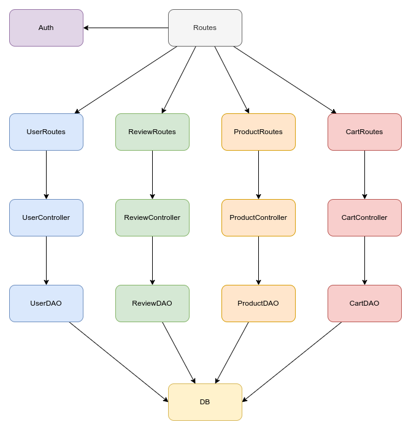

# Test Report

The goal of this document is to explain how the application was tested, detailing how the test cases were defined and what they cover.

# Contents

- [Test Report](#test-report)
- [Contents](#contents)
- [Dependency graph](#dependency-graph)
- [Integration approach](#integration-approach)
- [Tests](#tests)
  - [User Unit Tests](#user-unit-tests)
  - [Cart Unit Tests](#cart-unit-tests)
  - [Cart Integration Tests](#cart-integration-tests)
- [Coverage](#coverage)
  - [Coverage of FR](#coverage-of-fr)
  - [Coverage white box](#coverage-white-box)

# Dependency graph

# Integration approach

    <Write here the integration sequence you adopted, in general terms (top down, bottom up, mixed) and as sequence
    
    (ex: step1: unit A, step 2: unit A+B, step 3: unit A+B+C, etc)>
    
    <Some steps may  correspond to unit testing (ex step1 in ex above)>
    
    <One step will  correspond to API testing, or testing unit route.js>
    
    step1: unit DAO
    step2: unit Controller
    step3: unit Route
    step4

# Tests

## User Unit Tests

|     Test case name      | Object(s) tested | Test level | Technique used |
| :---------------------: | :--------------: | :--------: | :------------: |
|   User authentication   |     UserDAO      |    Unit    |       WB       |
|     Create account      |     UserDAO      |    Unit    |       WB       |
|  Get user by username   |     UserDAO      |    Unit    |       WB       |
|      Get all users      |     UserDAO      |    Unit    |       WB       |
|    Get users by role    |     UserDAO      |    Unit    |       WB       |
| Delete user by username |     UserDAO      |    Unit    |       WB       |
|    Delete all users     |     UserDAO      |    Unit    |       WB       |
|    Update user info     |     UserDAO      |    Unit    |       WB       |
|                         |                  |            |                |
|     Create new user     |  UserController  |    Unit    |       WB       |
|        Get users        |  UserController  |    Unit    |       WB       |
|    Get users by role    |  UserController  |    Unit    |       WB       |
|  Get user by username   |  UserController  |    Unit    |       WB       |
| Delete user by username |  UserController  |    Unit    |       WB       |
|    Delete all users     |  UserController  |    Unit    |       WB       |
| Update user information |  UserController  |    Unit    |       WB       |
|                         |                  |            |                |
|         POST /          |    UserRoutes    |    Unit    |       WB       |
|          GET /          |    UserRoutes    |    Unit    |       WB       |
|    GET /roles/:role     |    UserRoutes    |    Unit    |       WB       |
|     GET /:username      |    UserRoutes    |    Unit    |       WB       |
|    DELETE /:username    |    UserRoutes    |    Unit    |       WB       |
|        DELETE /         |    UserRoutes    |    Unit    |       WB       |
|    PATCH /:username     |    UserRoutes    |    Unit    |       WB       |

## User Integration Tests

|      Test case name      | Object(s) tested | Test level | Technique used |
| :----------------------: | :--------------: | :--------: | :------------: |
|       POST /users        |    UserRoutes    |    API     |       BB       |
| DELETE /sessions/current |    UserRoutes    |    API     |       BB       |
|      POST /sessions      |    UserRoutes    |    API     |       BB       |
|        GET /users        |    UserRoutes    |    API     |       BB       |
|  GET /users/roles/:role  |    UserRoutes    |    API     |       BB       |
|   GET /users/:username   |    UserRoutes    |    API     |       BB       |
|  PATCH /users/:username  |    UserRoutes    |    API     |       BB       |
| DELETE /users/:username  |    UserRoutes    |    API     |       BB       |
|      DELETE /users       |    UserRoutes    |    API     |       BB       |

## Cart Unit Tests

|   Test case name    | Object(s) tested | Test level |     Technique used     |
| :-----------------: | :--------------: | :--------: | :--------------------: |
| Cart creation and visualization |     CartDAO      |    Unit    | WB |
| Create empty cart |     CartDAO      |    Unit    | WB |
| Get current cart |     CartDAO      |    Unit    | WB |
| Add product to cart |     CartDAO      |    Unit    | WB |
| Remove product from cart |     CartDAO      |    Unit    | WB |
| Modify product quantity in cart |     CartDAO      |    Unit    | WB |
| Get paid carts |     CartDAO      |    Unit    | WB |
| Delete all carts |     CartDAO      |    Unit    | WB |
| Get all carts |     CartDAO      |    Unit    | WB |
| Delete all products from a cart |     CartDAO      |    Unit    | WB |
| Check availability of a product in cart |     CartDAO      |    Unit    | WB |
| Checkout current cart |     CartDAO      |    Unit    | WB |
| | | ||
| Add to cart |     CartController      |    Unit    | WB |
| Get cart |     CartController      |    Unit    | WB |
| Checkout cart |     CartController      |    Unit    | WB |
| Get customer carts |     CartController      |    Unit    | WB |
| Remove product from cart |     CartController      |    Unit    | WB |
| Clear cart |     CartController      |    Unit    | WB |
| Delete all carts |     CartController      |    Unit    | WB |
| Get all carts |     CartController      |    Unit    | WB |
| | | ||
| GET / | CartRoutes | Unit | WB |
| POST / | CartRoutes | Unit | WB |
| PATCH / | CartRoutes | Unit | WB |
| GET /history | CartRoutes | Unit | WB |
| DELETE /products/:model | CartRoutes | Unit | WB |
| DELETE /current | CartRoutes | Unit | WB |
| DELETE / | CartRoutes | Unit | WB |
| GET /all | CartRoutes | Unit | WB |

## Cart Integration Tests

|   Test case name    | Object(s) tested | Test level |     Technique used     |
| :-----------------: | :--------------: | :--------: | :--------------------: |
| GET /ezelectronics/carts |     CartRoutes     |    API    | BB |
| GET /ezelectronics/carts/history |     CartRoutes     |    API    | BB |
| POST /ezelectronics/carts |     CartRoutes     |    API    | BB |
| PATCH /ezelectronics/carts |     CartRoutes     |    API    | BB |
| DELETE /ezelectronics/carts/products/:model |     CartRoutes     |    API    | BB |
| DELETE /ezelectronics/carts/current |     CartRoutes     |    API    | BB |
| GET /ezelectronics/carts/all |     CartRoutes     |    API    | BB |
| DELETE /ezelectronics/carts |     CartRoutes     |    API    | BB |

# Coverage

## Coverage of FR

| Functional Requirement or scenario | Test(s) |
| :--------------------------------: | :-----: |
|               FR1.1                |         |
|               FR1.2                |         |
|               FR1.3                |         |
|               FR2.1                |         |
|               FR2.2                |         |
|               FR2.3                |         |
|               FR2.4                |         |
|               FR2.5                |         |
|               FR2.6                |         |
|               FR3.1                |         |
|               FR3.2                |         |
|               FR3.3                |         |
|               FR3.4                |         |
|              FR3.4.1               |         |
|               FR3.5                |         |
|              FR3.5.1               |         |
|               FR3.6                |         |
|              FR3.6.1               |         |
|               FR3.7                |         |
|               FR3.8                |         |
|               FR4.1                |         |
|               FR4.2                |         |
|               FR4.3                |         |
|               FR4.4                |         |
|               FR4.5                |         |
|               FR5.1                |  GET /ezelectronics/carts        |
|               FR5.2                | POST /ezelectronics/carts        |
|               FR5.3                | PATCH /ezelectronics/carts        |
|               FR5.4                | GET /ezelectronics/carts/history        |
|               FR5.5                | DELETE /ezelectronics/carts/products/:model        |
|               FR5.6                | DELETE /ezelectronics/carts/current        |
|               FR5.7                | GET /ezelectronics/carts/all         |
|               FR5.8                | DELETE /ezelectronics/carts         |

## Coverage white box

