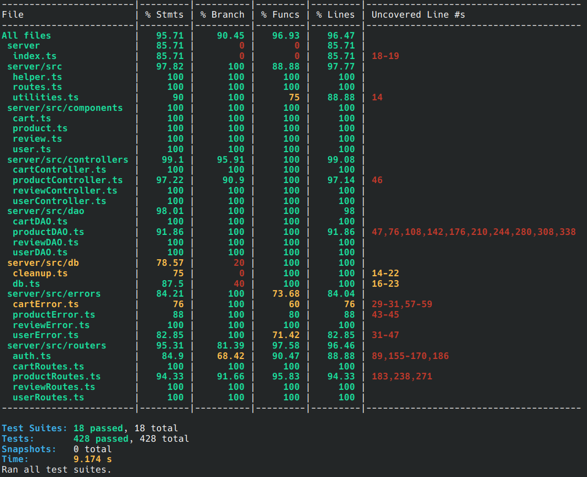

# Test Report

<The goal of this document is to explain how the application was tested, detailing how the test cases were defined and what they cover>

# Contents

- [Test Report](#test-report)
- [Contents](#contents)
- [Dependency graph](#dependency-graph)
- [Integration approach](#integration-approach)
- [Tests](#tests)
- [Coverage](#coverage)
  - [Coverage of FR](#coverage-of-fr)
  - [Coverage white box](#coverage-white-box)

# Dependency graph

     <report the here the dependency graph of EzElectronics>

# Integration approach

    <Write here the integration sequence you adopted, in general terms (top down, bottom up, mixed) and as sequence
    
    (ex: step1: unit A, step 2: unit A+B, step 3: unit A+B+C, etc)>
    
    <Some steps may  correspond to unit testing (ex step1 in ex above)>
    
    <One step will  correspond to API testing, or testing unit route.js>
    
    step1: unit DAO
    step2: unit Controller
    step3: unit Route
    step4

# Tests

<in the table below list the test cases defined For each test report the object tested, the test level (API, integration, unit) and the technique used to define the test case (BB/ eq partitioning, BB/ boundary, WB/ statement coverage, etc)> <split the table if needed>

## User Unit Tests

|   Test case name    | Object(s) tested | Test level |     Technique used     |
| :-----------------: | :--------------: | :--------: | :--------------------: |
| User authentication |     UserDAO      |    Unit    | WB/ statement coverage |

# Coverage

## Coverage of FR

<Report in the following table the coverage of functional requirements and scenarios(from official requirements) >

| Functional Requirement or scenario | Test(s) |
| :--------------------------------: | :-----: |
|               FR1.1                |         |
|               FR1.2                |         |
|               FR1.3                |         |
|               FR2.1                |         |
|               FR2.2                |         |
|               FR2.3                |         |
|               FR2.4                |         |
|               FR2.5                |         |
|               FR2.6                |         |
|               FR3.1                |         |
|               FR3.2                |         |
|               FR3.3                |         |
|               FR3.4                |         |
|              FR3.4.1               |         |
|               FR3.5                |         |
|              FR3.5.1               |         |
|               FR3.6                |         |
|              FR3.6.1               |         |
|               FR3.7                |         |
|               FR3.8                |         |
|               FR4.1                |         |
|               FR4.2                |         |
|               FR4.3                |         |
|               FR4.4                |         |
|               FR4.5                |         |
|               FR5.1                |         |
|               FR5.2                |         |
|               FR5.3                |         |
|               FR5.4                |         |
|               FR5.5                |         |
|               FR5.6                |         |
|               FR5.7                |         |
|               FR5.8                |         |

## Coverage white box

